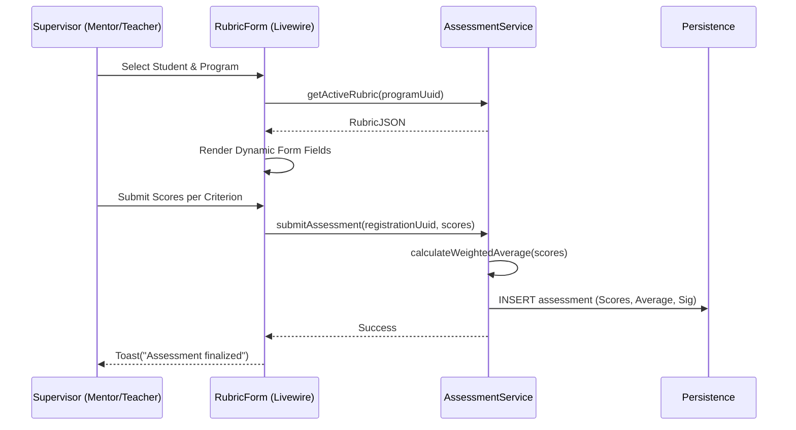

# Application Blueprint: Rubric-Based Evaluation (BP-EVAL-F501)

**Blueprint ID**: `BP-EVAL-F501` | **Requirement ID**: `SYRS-F-501` | **Scope**:
`Assessment & Synthesis`

---

## 1. Strategic Context

- **Spec Alignment**: This blueprint authorizes the rubric-based scoring mechanism required to
  satisfy **[SYRS-F-501]** (Rubric-Based Evaluation).
- **Objective**: Establish a flexible assessment framework allowing qualitative evaluation based on
  institutional competency rubrics.
- **Rationale**: Vocational success requires qualitative assessment. JSON-based rubrics allow
  curriculum evolution without code changes, ensuring marks are traceable to academic criteria.

---

## 2. Logic & Architecture (Systemic View)

### 2.1 The Rubric Strategy

- **JSON Flexibility**: Rubrics MUST be stored as structured JSON blobs.
- **Weighted Input**: Supports distinct inputs from Industry Mentor and Academic Teacher.

### 2.2 System Interaction Diagram (Scoring Flow)

### 2.3 Persistence Specification (Schema)

| Column            | Type      | Index   | Nullable | Description          |
| :---------------- | :-------- | :------ | :------- | :------------------- |
| `id`              | `UUID`    | Primary | No       | Record identifier.   |
| `registration_id` | `UUID`    | Indexed | No       | Registration link.   |
| `supervisor_id`   | `UUID`    | No      | No       | Evaluator link.      |
| `scores`          | `JSON`    | No      | No       | Raw criteria scores. |
| `final_score`     | `Decimal` | Indexed | No       | Synthesized average. |
| `letter_grade`    | `String`  | No      | Yes      | Hook-computed grade. |

---

## 3. Presentation Strategy (User Experience View)

### 3.1 UX Workflow

- **Dynamic Form**: UI renders fields based on rubric JSON (sliders, radios).
- **Performance Radar**: Visualization of achievement across criteria.

### 3.2 Interface Design

- **Assessment Wizard**: Component (`assessment::rubric-form`) guiding through levels.

---

## 4. Verification Strategy (V&V View)

### 4.1 Unit Verification

- **Schema Validation**: Ensure JSON adheres to internal spec.
- **Math Accuracy**: Verify weighted average logic.

### 4.2 Feature Validation

- **Authorization Leak**: unassigned Teacher cannot assess student (403).
- **Validation Audit**: Mandatory criteria enforced.

---

## 5. Compliance & Standardization (Integrity View)

### 5.1 Curriculum Alignment

- **Traceability**: Score record linked to rubric version.

---

### 5.2 Mandatory 3S Audit Alignment

To guarantee architectural integrity and prevent systemic entropy, this implementation MUST strictly
adhere to the project's 3S Protocol:

- **S1 (Secure)**: Every state-altering method within the Service Layer MUST explicitly invoke
  `Gate::authorize()` prior to execution to prevent IDOR and Broken Access Control. Sensitive PII
  fields MUST utilize the `encrypted` cast.
- **S2 (Sustain)**: All files MUST declare `strict_types=1`. Virtual attributes MUST be implemented
  using explicit typing and standard methods. All user-facing strings and exceptions MUST be localized via
  `__('key')`. Every public method MUST contain professional PHPDoc explaining its intent.
- **S3 (Scalable)**: Cross-module interactions MUST use **Contract-First** dependency injection
  (Interfaces). All domain models MUST implement `HasUuid` (and `HasStatus`, `HasAcademicYear` where
  applicable). Asynchronous side-effects MUST utilize Domain Events with lightweight, UUID-only
  payloads.

## 6. Documentation Strategy (Knowledge View)

### 6.1 Engineering Record

- **Developer Guide**: Update `modules/Assessment/README.md` for JSON schema.

### 6.2 Stakeholder Manuals

- **Staff Guide**: Update `docs/wiki/assessment-and-evaluation.md` for evaluation process.

---

## 7. Actionable Implementation Path

1.  **Issue #Assess1**: Define standard Rubric JSON Schema.
2.  **Issue #Assess2**: Implement `AssessmentService` with weighted logic.
3.  **Issue #Assess3**: Build Dynamic Rubric Form component.
4.  **Issue #Assess4**: Create the Performance Radar visualization component.

---

## 8. Exit Criteria & Quality Gates

- **Acceptance Criteria**: Form functional; Weighted scoring verified; Authorization enforced.
- **Verification Protocols**: 100% pass rate in assessment test suite.
- **Quality Gate**: Expert audit confirms grade synthesis matches standards.

---

_Application Blueprints prevent architectural decay and ensure continuous alignment with the
foundational specifications._
