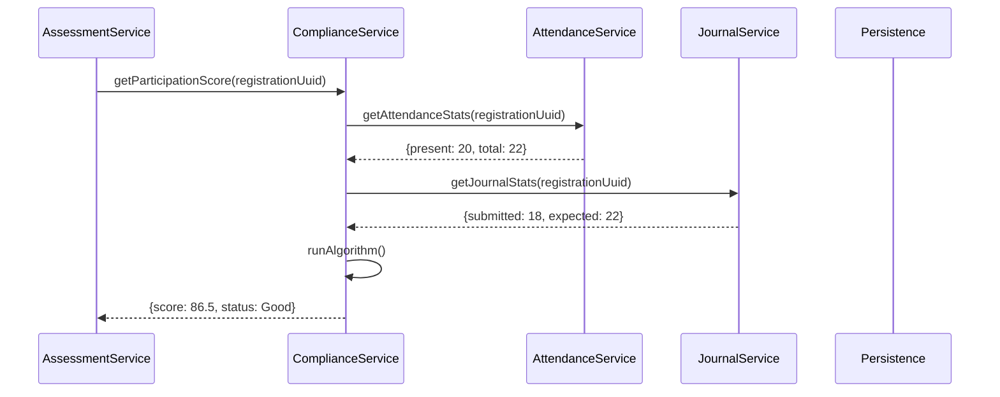

# Application Blueprint: Compliance Automation (BP-EVAL-F502)

**Blueprint ID**: `BP-EVAL-F502` | **Requirement ID**: `SYRS-F-502` | **Scope**:
`Assessment & Synthesis`

---

## 1. Strategic Context

- **Spec Alignment**: This blueprint authorizes the participation scoring engine required to satisfy
  **[SYRS-F-502]** (Compliance Automation).
- **Objective**: Establish a deterministic mechanism for converting telemetry (Attendance/Journals)
  into participation scores.
- **Rationale**: Manual scoring is biased. Automating compliance provides real-time feedback and
  ensures final grades reflect vocational consistency.

---

## 2. Logic & Architecture (Systemic View)

### 2.1 The Scoring Algorithm

`ComplianceService` calculates score via:

1.  **Attendance Consistency**: (Present / Total Days) \* 100.
2.  **Journal Responsiveness**: (On-time Journals / Required) \* 100.

### 2.2 System Interaction Diagram (Aggregation Flow)

### 2.3 Data Synthesis Invariants

- **Capping**: Score strictly capped at 100.00.
- **Authorized Absence**: Approved absences excluded from denominator.

---

## 3. Presentation Strategy (User Experience View)

### 3.1 UX Workflow

- **Progress Gauge**: Real-time "Compliance Meter" on student dashboard.
- **Drill-down**: Click score to see contributing logs.

### 3.2 Interface Design

- **Telemetry Summary**: Component (`assessment::telemetry-status`) visualizing ratios.

---

## 4. Verification Strategy (V&V View)

### 4.1 Unit Verification

- **Math Accuracy**: Verify synthesized output against raw payloads.
- **Edge Cases**: Handle 0 expected days gracefully.

### 4.2 Feature Validation

- **Data Integrity**: Guard against scoring inactive registrations.
- **Capping Enforcement**: Verification of max score boundary.

---

## 5. Compliance & Standardization (Integrity View)

### 5.1 Performance

- **Memory Stability**: Large telemetry sets use cursors.

---

### 5.2 Mandatory 3S Audit Alignment

To guarantee architectural integrity and prevent systemic entropy, this implementation MUST strictly
adhere to the project's 3S Protocol:

- **S1 (Secure)**: Every state-altering method within the Service Layer MUST explicitly invoke
  `Gate::authorize()` prior to execution to prevent IDOR and Broken Access Control. Sensitive PII
  fields MUST utilize the `encrypted` cast.
- **S2 (Sustain)**: All files MUST declare `strict_types=1`. Virtual attributes MUST be implemented
  using PHP 8.4 Property Hooks. All user-facing strings and exceptions MUST be localized via
  `__('key')`. Every public method MUST contain professional PHPDoc explaining its intent.
- **S3 (Scalable)**: Cross-module interactions MUST use **Contract-First** dependency injection
  (Interfaces). All domain models MUST implement `HasUuid` (and `HasStatus`, `HasAcademicYear` where
  applicable). Asynchronous side-effects MUST utilize Domain Events with lightweight, UUID-only
  payloads.

## 6. Documentation Strategy (Knowledge View)

### 6.1 Engineering Record

- **Developer Guide**: Update `modules/Assessment/README.md` for algorithm.

### 6.2 Stakeholder Manuals

- **Admin Guide**: Update `docs/wiki/assessment-and-evaluation.md` for weights.

---

## 7. Actionable Implementation Path

1.  **Issue #Comp1**: Implement `ComplianceService` aggregator.
2.  **Issue #Comp2**: Create weighted synthesis logic.
3.  **Issue #Comp3**: Develop the Dashboard Gauge component.
4.  **Issue #Comp4**: Build the Telemetry Drill-down interface.

---

## 8. Exit Criteria & Quality Gates

- **Acceptance Criteria**: Scoring verified; Absences handled; Capping enforced.
- **Verification Protocols**: 100% pass rate in compliance test suite.
- **Quality Gate**: Manual vs Automated score variance audit (Target: 0).

---

_Application Blueprints prevent architectural decay and ensure continuous alignment with the
foundational specifications._
