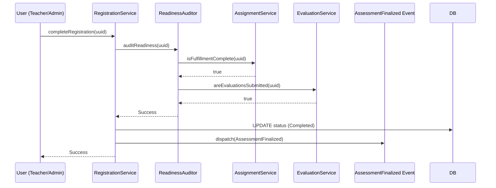

# Application Blueprint: Readiness Auditing (BP-EVAL-F503)

**Blueprint ID**: `BP-EVAL-F503` | **Requirement ID**: `SYRS-F-503` | **Scope**:
`Assessment & Synthesis`

---

## 1. Strategic Context

- **Spec Alignment**: This blueprint authorizes the "Go/No-Go" finalization gate required to satisfy
  **[SYRS-F-503]** (Readiness Auditing).
- **Objective**: Establish an automated verification gate ensuring student finalization occurs only
  after 100% prerequisite clearance.
- **Rationale**: Program completion is a legal milestone. Automating the audit prevents premature
  finalization and ensures institutional records are verified.

---

## 2. Logic & Architecture (Systemic View)

### 2.1 The Readiness Invariant

Multi-dimensional audit of:

1.  **Administrative**: Requirements marked `verified`.
2.  **Fulfillment**: Mandatory assignments `verified`.
3.  **Evaluation**: Both rubrics submitted.
4.  **Vocational**: No pending Check-Ins.

### 2.2 System Interaction Diagram (Gate Flow)

---

## 3. Presentation Strategy (User Experience View)

### 3.1 UX Workflow

- **Completion Wizard**: Real-time "Readiness Checklist" display.
- **Visual Locking**: "Finalize" button hidden until auditor returns success.

### 3.2 Interface Design

- **Audit Status**: Component (`assessment::readiness-check`) with icons.

---

## 4. Verification Strategy (V&V View)

### 4.1 Unit Verification

- **Audit Logic**: Test all permutations of missing/complete data.
- **Single-Failure Audit**: Verify one missing assignment blocks finalization.

### 4.2 Feature Validation

- **Completion Guard**: PATCH request with incomplete data returns `422`.
- **Event Integrity**: Event dispatched ONLY after success.

---

## 5. Compliance & Standardization (Integrity View)

### 5.1 Atomicity

- **Transactional Gate**: Audit executed within transaction to prevent drift.

---

### 5.2 Mandatory 3S Audit Alignment

To guarantee architectural integrity and prevent systemic entropy, this implementation MUST strictly
adhere to the project's 3S Protocol:

- **S1 (Secure)**: Every state-altering method within the Service Layer MUST explicitly invoke
  `Gate::authorize()` prior to execution to prevent IDOR and Broken Access Control. Sensitive PII
  fields MUST utilize the `encrypted` cast.
- **S2 (Sustain)**: All files MUST declare `strict_types=1`. Virtual attributes MUST be implemented
  using explicit typing and standard methods. All user-facing strings and exceptions MUST be localized via
  `__('key')`. Every public method MUST contain professional PHPDoc explaining its intent.
- **S3 (Scalable)**: Cross-module interactions MUST use **Contract-First** dependency injection
  (Interfaces). All domain models MUST implement `HasUuid` (and `HasStatus`, `HasAcademicYear` where
  applicable). Asynchronous side-effects MUST utilize Domain Events with lightweight, UUID-only
  payloads.

## 6. Documentation Strategy (Knowledge View)

### 6.1 Engineering Record

- **Developer Guide**: Update `modules/Assessment/README.md` for hooks.

### 6.2 Stakeholder Manuals

- **Staff Guide**: Update `docs/wiki/assessment-and-evaluation.md` for criteria.

---

## 7. Actionable Implementation Path

1.  **Issue #Ready1**: Implement `ReadinessAuditor` domain service.
2.  **Issue #Ready2**: Integrate auditor into `RegistrationService`.
3.  **Issue #Ready3**: Build the UI Checklist component.
4.  **Issue #Ready4**: Implement the `AssessmentFinalized` event bus.

---

## 8. Exit Criteria & Quality Gates

- **Acceptance Criteria**: Readiness gate operational; Error reporting functional.
- **Verification Protocols**: 100% pass rate in finalization test suite.
- **Quality Gate**: Audit confirms zero "Incomplete" registrations completed.

---

_Application Blueprints prevent architectural decay and ensure continuous alignment with the
foundational specifications._
