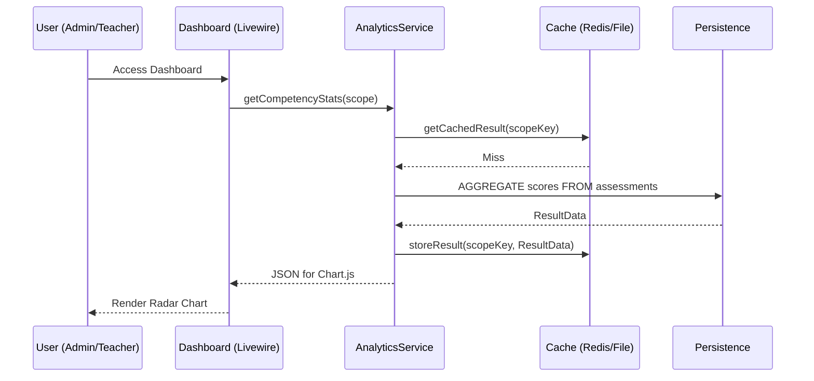

# Application Blueprint: Visual Analytics (BP-EVAL-F504)

**Blueprint ID**: `BP-EVAL-F504` | **Requirement ID**: `SYRS-F-504` | **Scope**:
`Assessment & Synthesis`

---

## 1. Strategic Context

- **Spec Alignment**: This blueprint authorizes the visual aggregation engine required to satisfy
  **[SYRS-F-504]** (Visual Analytics).
- **Objective**: Provide visual insights into competency achievements and participation trends.
- **Rationale**: Raw data is hard to interpret. Visual charts enable rapid identification of high
  performance and friction points.

---

## 2. Logic & Architecture (Systemic View)

### 2.1 The Aggregation Engine

- **Scalability**: Aggregations MUST use Laravel `remember` cache.
- **Partitioning**: Data partitioned by `AcademicYear` and `Department`.

### 2.2 System Interaction Diagram (Visual Flow)

### 2.3 Core Metrics

1.  **Competency Radar**: Expected vs Actual scores.
2.  **Participation Trend**: Attendance vs Journal consistency.

---

## 3. Presentation Strategy (User Experience View)

### 3.1 UX Workflow

- **Role-Aware**: Admins see school trends; Teachers see students.
- **Student View**: Personal achievement vs cohort average.

### 3.2 Interface Design

- **Analytics Shell**: Standard layout (`ui::analytics-shell`) ensuring responsiveness.

---

## 4. Verification Strategy (V&V View)

### 4.1 Unit Verification

- **Cache Integrity**: Verify invalidation when assessments finalized.
- **Math Accuracy**: verify aggregated radar scores match raw records.

### 4.2 Feature Validation

- **Scope Isolation**: Teacher restricted from foreign department data.
- **Responsive Audit**: Mobile viewport overflow check.

---

## 5. Compliance & Standardization (Integrity View)

### 5.1 Accessibility

- **ARIA Charts**: fallback labels for screen readers (WCAG 2.1 AA).

---

### 5.2 Mandatory 3S Audit Alignment

To guarantee architectural integrity and prevent systemic entropy, this implementation MUST strictly
adhere to the project's 3S Protocol:

- **S1 (Secure)**: Every state-altering method within the Service Layer MUST explicitly invoke
  `Gate::authorize()` prior to execution to prevent IDOR and Broken Access Control. Sensitive PII
  fields MUST utilize the `encrypted` cast.
- **S2 (Sustain)**: All files MUST declare `strict_types=1`. Virtual attributes MUST be implemented
  using PHP 8.4 Property Hooks. All user-facing strings and exceptions MUST be localized via
  `__('key')`. Every public method MUST contain professional PHPDoc explaining its intent.
- **S3 (Scalable)**: Cross-module interactions MUST use **Contract-First** dependency injection
  (Interfaces). All domain models MUST implement `HasUuid` (and `HasStatus`, `HasAcademicYear` where
  applicable). Asynchronous side-effects MUST utilize Domain Events with lightweight, UUID-only
  payloads.

## 6. Documentation Strategy (Knowledge View)

### 6.1 Engineering Record

- **Technical Reference**: Update `docs/dev/ui-ux.md` for charting standards.

### 6.2 Stakeholder Manuals

- **Admin Guide**: Update `docs/wiki/reporting.md` for dashboard KPIs.

---

## 7. Actionable Implementation Path

1.  **Issue #Chart1**: Integrate Charting Library (Vanilla/Alpine wrapper).
2.  **Issue #Chart2**: Implement `AnalyticsService` with caching.
3.  **Issue #Chart3**: Build the Role-Aware Dashboard layouts.
4.  **Issue #Chart4**: Implement WCAG fallback for SVG/Canvas elements.

---

## 8. Exit Criteria & Quality Gates

- **Acceptance Criteria**: Dashboards functional; Role-scoping enforced; Caching verified.
- **Verification Protocols**: 100% pass rate in analytics test suite.
- **Quality Gate**: Dashboard load < 500ms for 1,000 students.

---

_Application Blueprints prevent architectural decay and ensure continuous alignment with the
foundational specifications._
