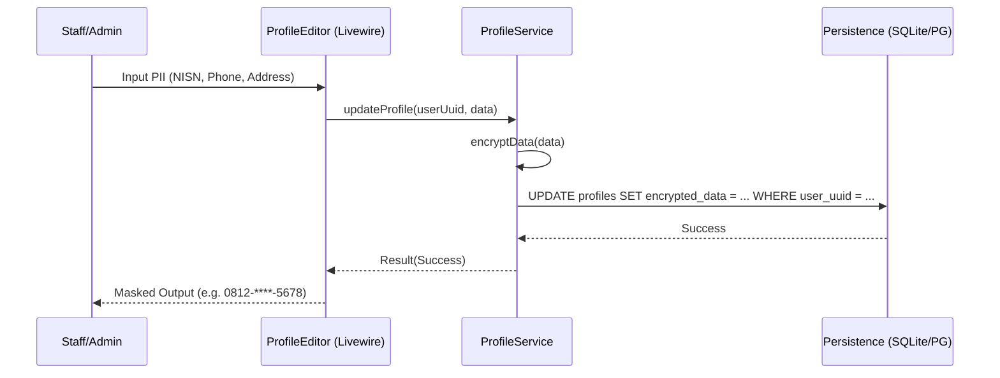

# Application Blueprint: Unified Profile (BP-ID-F201)

**Blueprint ID**: `BP-ID-F201` | **Requirement ID**: `SYRS-F-201` | **Scope**: `Identity & Security`

---

## 1. Strategic Context

- **Spec Alignment**: This blueprint authorizes the single-profile mapping strategy and PII
  protection required to satisfy **[SYRS-F-201]** (Unified Profile) and **[SYRS-NF-503]** (Data
  Privacy).
- **Objective**: Establish a centralized, encrypted, and immutable identity foundation that links
  system authentication (`User`) with institutional metadata (`Profile`).
- **Rationale**: Handling PII (Personally Identifiable Information) such as NISN, phone numbers, and
  addresses requires a "Security-by-Design" approach. By centralizing these in an encrypted profile
  model, we simplify compliance and minimize the surface area for data leaks.

---

## 2. Logic & Architecture (Systemic View)

### 2.1 The Dual-Entity Identity Model

Internara separates the **Authentication Subject** from the **Institutional Object**:

- **`Modules\User\Models\User`**: Responsible for credentials, roles, and session state.
- **`Modules\Profile\Models\Profile`**: Responsible for PII, national identifiers, and institutional
  metadata.

### 2.2 System Interaction Diagram (Identity Mapping)

### 2.3 Persistence Specification (Schema)

| Column                | Type     | Index   | Nullable | Description                           |
| :-------------------- | :------- | :------ | :------- | :------------------------------------ |
| `id`                  | `UUID`   | Primary | No       | Primary key for the profile record.   |
| `user_id`             | `UUID`   | Unique  | No       | Atomic link to the `users` table.     |
| `national_identifier` | `String` | Indexed | Yes      | Encrypted NISN/NIP.                   |
| `registration_number` | `String` | Indexed | Yes      | Encrypted institutional ID (NIS/NIP). |
| `phone`               | `String` | No      | Yes      | Encrypted contact number.             |
| `address`             | `Text`   | No      | Yes      | Encrypted physical address.           |

### 2.4 Data Security Invariants

- **Field-Level Encryption**: Sensitive fields MUST use Laravel's `encrypted` cast.
- **Zero-Logging**: The `PiiMaskingProcessor` MUST redact profile fields from all logging sinks.

---

## 3. Presentation Strategy (User Experience View)

### 3.1 UX Workflow

- **Synchronized Registration**: During account creation, the system populates both tables in a
  single transaction.
- **Masked Display**: UI components should default to masking sensitive fields unless explicitly
  "revealed" by authorized subjects.

### 3.2 Interface Design

- **Profile Card**: A standardized UI component (`ui::profile-card`) providing a consistent view of
  identity across all modules.

---

## 4. Verification Strategy (V&V View)

### 4.1 Unit Verification

- **Encryption Audit**: Unit tests verifying that raw SQL queries return ciphertext while Eloquent
  returns plaintext.
- **Hydration Logic**: Verification that `HasUuid` correctly initializes identifiers.

### 4.2 Feature Validation

- **Atomic Rollback**: Ensures failure in Profile creation triggers rollback of the User record.
- **IDOR Protection**: Verification that students cannot update another user's Profile UUID.

### 4.3 Architecture Verification

- **Modular Sovereignty**: Pest Arch tests ensuring only `User` and `Profile` modules contain
  identity models.

---

## 5. Compliance & Standardization (Integrity View)

### 5.1 Privacy & GDPR Alignment

- **Right to Erasure**: Implementation of `SoftDeletes` for both User and Profile entities.
- **Data Minimization**: Only store PII explicitly required for internship administration.

---

### 5.2 Mandatory 3S Audit Alignment

To guarantee architectural integrity and prevent systemic entropy, this implementation MUST strictly
adhere to the project's 3S Protocol:

- **S1 (Secure)**: Every state-altering method within the Service Layer MUST explicitly invoke
  `Gate::authorize()` prior to execution to prevent IDOR and Broken Access Control. Sensitive PII
  fields MUST utilize the `encrypted` cast.
- **S2 (Sustain)**: All files MUST declare `strict_types=1`. Virtual attributes MUST be implemented
  using PHP 8.4 Property Hooks. All user-facing strings and exceptions MUST be localized via
  `__('key')`. Every public method MUST contain professional PHPDoc explaining its intent.
- **S3 (Scalable)**: Cross-module interactions MUST use **Contract-First** dependency injection
  (Interfaces). All domain models MUST implement `HasUuid` (and `HasStatus`, `HasAcademicYear` where
  applicable). Asynchronous side-effects MUST utilize Domain Events with lightweight, UUID-only
  payloads.

## 6. Documentation Strategy (Knowledge View)

### 6.1 Engineering Record

- **Governance Standards**: Update `docs/dev/governance.md` to document the PII protection
  invariants.

### 6.2 Stakeholder Manuals

- **Privacy Policy**: Drafting of the data protection notice in the Wiki.

---

## 7. Actionable Implementation Path

1.  **Issue #Profile1**: Migration for `profiles` table with atomic unique UUID link to `users`.
2.  **Issue #Profile2**: Implement `encrypted` casts on the `Profile` model.
3.  **Issue #Profile3**: Construct `ProfileService` with cross-module hydration logic.
4.  **Issue #Profile4**: Develop the masked `ProfileCard` component.

---

## 8. Exit Criteria & Quality Gates

- **Acceptance Criteria**: Encryption active; atomic linkage verified; IDOR protection confirmed.
- **Verification Protocols**: 100% pass rate in the identity and security test suite.
- **Quality Gate**: Security audit confirms zero plain-text PII storage.

---

_Application Blueprints prevent architectural decay and ensure continuous alignment with the
foundational specifications._
