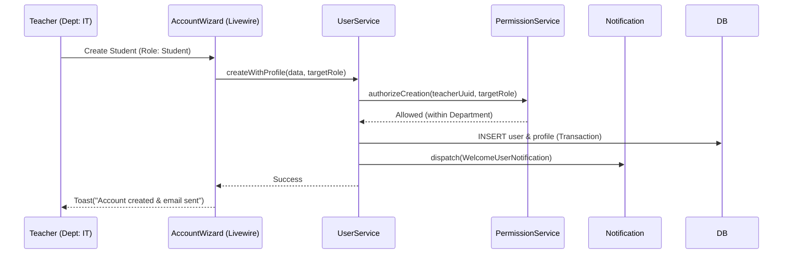

# Application Blueprint: Hierarchical Account Creation (BP-ID-F203)

**Blueprint ID**: `BP-ID-F203` | **Requirement ID**: `SYRS-F-203` | **Scope**: `Identity & Security`

---

## 1. Strategic Context

- **Spec Alignment**: This blueprint authorizes the delegated authority model required to satisfy
  **[SYRS-F-203]** (Hierarchical Account Creation).
- **Objective**: Establish a secure, role-based user provisioning system where administrative
  responsibility is distributed according to institutional hierarchy.
- **Rationale**: User management should not be a centralized bottleneck. By allowing Teachers to
  manage Students and Admins to manage Teachers, we reflect the institutional structure while
  maintaining strict security boundaries.

---

## 2. Logic & Architecture (Systemic View)

### 2.1 The Delegation Invariant

The system enforces a strict "Upper-to-Lower" provisioning rule:

- **`SuperAdmin`**: Can create all roles.
- **`Admin`**: Can create Teachers, Mentors, Staff, and Students.
- **`Teacher`**: Can only create Students within their assigned Department.
- **`Student/Mentor`**: Prohibited from creating accounts.

### 2.2 System Interaction Diagram (Provisioning Flow)

### 2.3 Service Contract Specifications

- **`Modules\User\Services\Contracts\UserService`**: MUST implement the `createWithProfile` method
  which wraps both records in a single transaction.
- **`Modules\User\Policies\UserPolicy`**: The authoritative source for authorization logic,
  evaluating both the subject and target roles.

---

## 3. Presentation Strategy (User Experience View)

### 3.1 UX Workflow

- **Role Filtering**: The creation interface MUST automatically filter available roles based on the
  authenticated user's permissions.
- **Departmental Binding**: For Teachers, newly created Students are automatically bound to the
  Teacher's active department.

### 3.2 Interface Design

- **User Manager Component**: A functional Livewire component for listing, filtering, and creating
  stakeholders according to the hierarchy.

---

## 4. Verification Strategy (V&V View)

### 4.1 Unit Verification

- **Policy Logic**: Unit tests for `UserPolicy::create` covering all role permutations.
- **Transaction Integrity**: Verification that Profile failure prevents User record persistence.

### 4.2 Feature Validation

- **Delegation Audit**: Integration tests verifying that a Teacher attempting to create an Admin
  results in a `403 Forbidden`.
- **Self-Service Lockdown**: Ensuring students cannot modify their own roles.

### 4.3 Architecture Verification

- **Service Isolation**: Pest Arch tests ensuring `UserPolicy` interacts with `Permission` module
  only via Contract.

---

## 5. Compliance & Standardization (Integrity View)

### 5.1 Security-by-Design

- **Welcome Protocol**: Successful creation triggers `WelcomeUserNotification` with a random
  password, ensuring credentials are never displayed in the browser.

---

### 5.2 Mandatory 3S Audit Alignment

To guarantee architectural integrity and prevent systemic entropy, this implementation MUST strictly
adhere to the project's 3S Protocol:

- **S1 (Secure)**: Every state-altering method within the Service Layer MUST explicitly invoke
  `Gate::authorize()` prior to execution to prevent IDOR and Broken Access Control. Sensitive PII
  fields MUST utilize the `encrypted` cast.
- **S2 (Sustain)**: All files MUST declare `strict_types=1`. Virtual attributes MUST be implemented
  using PHP 8.4 Property Hooks. All user-facing strings and exceptions MUST be localized via
  `__('key')`. Every public method MUST contain professional PHPDoc explaining its intent.
- **S3 (Scalable)**: Cross-module interactions MUST use **Contract-First** dependency injection
  (Interfaces). All domain models MUST implement `HasUuid` (and `HasStatus`, `HasAcademicYear` where
  applicable). Asynchronous side-effects MUST utilize Domain Events with lightweight, UUID-only
  payloads.

## 6. Documentation Strategy (Knowledge View)

### 6.1 Engineering Record

- **Security Guide**: Update `../security-architecture.md` to include the formal hierarchical
  authorization mapping.

### 6.2 Stakeholder Manuals

- **Admin Guide**: Update `docs/wiki/user-onboarding.md` to document the delegated authority model.

---

## 7. Actionable Implementation Path

1.  **Issue #Provision1**: Implement `UserPolicy::create` with role hierarchy checks.
2.  **Issue #Provision2**: Create `UserService::createWithProfile` with DB Transaction.
3.  **Issue #Provision3**: Construct the `WelcomeUserNotification` with secure random password
    logic.
4.  **Issue #Provision4**: Develop the `UserManager` Livewire component with role-aware filters.

---

## 8. Exit Criteria & Quality Gates

- **Acceptance Criteria**: Hierarchical creation operational; Policy enforcement verified;
  Transactional atomicity confirmed.
- **Verification Protocols**: 100% pass rate in the `User` management test suite.
- **Quality Gate**: Zero unauthorized role escalations identified during the security audit.

---

_Application Blueprints prevent architectural decay and ensure continuous alignment with the
foundational specifications._
