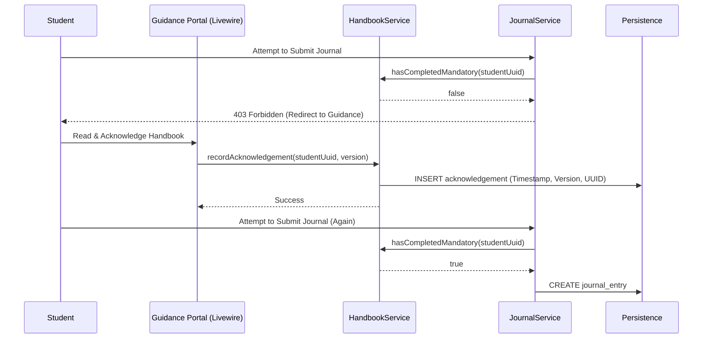

# Application Blueprint: Digital Guidance (BP-OPR-F303)

**Blueprint ID**: `BP-OPR-F303` | **Requirement ID**: `SYRS-F-303` | **Scope**:
`Internship Lifecycle`

---

## 1. Strategic Context

- **Spec Alignment**: This blueprint authorizes the mandatory handbook acknowledgement tracking
  required to satisfy **[SYRS-F-303]** (Digital Guidance).
- **Objective**: Ensure students have formally acknowledged institutional policies before being
  permitted to record vocational activities.
- **Rationale**: Academic compliance requires proof of notification. Gating "Check-In" and "Journal"
  features behind acknowledgement ensures no student operates without prior policy instruction.

---

## 2. Logic & Architecture (Systemic View)

### 2.1 The Guidance Gating Invariant

This is a cross-module security constraint:

- **Authority**: `Modules\Guidance\Services\Contracts\HandbookService`.
- **Integration**: `AttendanceService` and `JournalService` MUST invoke
  `HandbookService::hasCompletedMandatory()` as a prerequisite for any data mutation.

### 2.2 System Interaction Diagram (Gate Workflow)

### 2.3 Data Architecture

- **Version Persistence**: Acknowledgements MUST link to specific handbook versions to handle
  regulatory updates.
- **Audit Metadata**: Capturing IP, User-Agent, and Timestamp for legal non-repudiation.

---

## 3. Presentation Strategy (User Experience View)

### 3.1 UX Workflow

- **Forced Reading**: "Acknowledge" button inactive until scroll-to-bottom or minimum time elapsed.
- **Persistent Alert**: Dashboard displays high-priority warning until acknowledgement is clear.

### 3.2 Interface Design

- **Handbook Reader**: Clean component (`guidance::handbook-reader`) supporting Markdown content.

---

## 4. Verification Strategy (V&V View)

### 4.1 Unit Verification

- **Status Logic**: Tests for `hasCompletedMandatory()` covering version updates and legacy records.

### 4.2 Feature Validation

- **Gating Audit**: Verification that `AttendanceService::checkIn` returns `403` if guidance is
  missing.
- **IDOR Audit**: Ensuring students cannot acknowledge for others.

### 4.3 Architecture Verification

- **Isolation Audit**: Pest Arch tests ensuring zero model leakage between Journal and Guidance.

---

## 5. Compliance & Standardization (Integrity View)

### 5.1 Legal Traceability

- **Immutable Trail**: Acknowledgement records are immutable and auditable.

---

### 5.2 Mandatory 3S Audit Alignment

To guarantee architectural integrity and prevent systemic entropy, this implementation MUST strictly
adhere to the project's 3S Protocol:

- **S1 (Secure)**: Every state-altering method within the Service Layer MUST explicitly invoke
  `Gate::authorize()` prior to execution to prevent IDOR and Broken Access Control. Sensitive PII
  fields MUST utilize the `encrypted` cast.
- **S2 (Sustain)**: All files MUST declare `strict_types=1`. Virtual attributes MUST be implemented
  using PHP 8.4 Property Hooks. All user-facing strings and exceptions MUST be localized via
  `__('key')`. Every public method MUST contain professional PHPDoc explaining its intent.
- **S3 (Scalable)**: Cross-module interactions MUST use **Contract-First** dependency injection
  (Interfaces). All domain models MUST implement `HasUuid` (and `HasStatus`, `HasAcademicYear` where
  applicable). Asynchronous side-effects MUST utilize Domain Events with lightweight, UUID-only
  payloads.

## 6. Documentation Strategy (Knowledge View)

### 6.1 Engineering Record

- **Developer Reference**: Update `modules/Guidance/README.md` to document gating logic.

### 6.2 Stakeholder Manuals

- **Student Guide**: Update `docs/wiki/getting-started.md` to explain policy acknowledgement.

---

## 7. Actionable Implementation Path

1.  **Issue #Guide1**: Implement `HandbookService` status check.
2.  **Issue #Guide2**: Create `acknowledgements` migration with versioning.
3.  **Issue #Guide3**: Develop the Markdown `HandbookReader` component.
4.  **Issue #Guide4**: Integrate gating middleware into Attendance/Journal route groups.

---

## 8. Exit Criteria & Quality Gates

- **Acceptance Criteria**: Gating active; Reading verified; Acknowledgement logged; Cross-module
  blocking confirmed.
- **Verification Protocols**: 100% pass rate in the `Guidance` test suite.
- **Quality Gate**: Audit confirms zero "Activity without Acknowledgement" incidents.

---

_Application Blueprints prevent architectural decay and ensure continuous alignment with the
foundational specifications._
