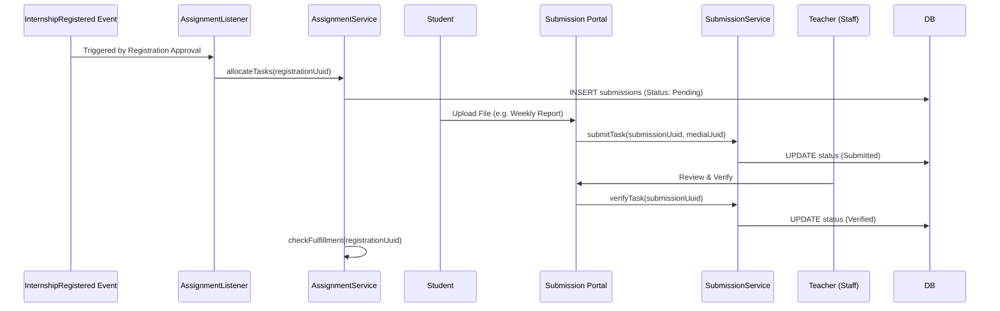

# Application Blueprint: Task Management (BP-OPR-F304)

**Blueprint ID**: `BP-OPR-F304` | **Requirement ID**: `SYRS-F-304` | **Scope**:
`Internship Lifecycle`

---

## 1. Strategic Context

- **Spec Alignment**: This blueprint authorizes the dynamic assignment engine required to satisfy
  **[SYRS-F-304]** (Task Management).
- **Objective**: Establish a systematic framework for the allocation, submission, and verification
  of mandatory institutional tasks student must fulfill.
- **Rationale**: Internships require deliverables (reports, forms). Automating task allocation
  ensures academic rigor and consistent evaluation across cohorts.

---

## 2. Logic & Architecture (Systemic View)

### 2.1 The Dynamic Allocation Engine

- **Event-Driven**: When registration is approved, `AssignmentService` scans active templates.
- **Payload**: Creates `Submission` records in `pending` status linked to registration.

### 2.2 System Interaction Diagram (Fulfillment Flow)

### 2.3 Fulfillment Invariants

- **Completion Gate**: Registration cannot transition to `completed` if mandatory assignments are
  not `verified`.
- **Submission Lifecycle**: `Pending` -> `Submitted` -> `Verified` (or `Rejected` -> `Submitted`).

---

## 3. Presentation Strategy (User Experience View)

### 3.1 UX Workflow

- **Task Checklist**: Dashboard features a live "Mandatory Tasks" widget.
- **Upload Queue**: Multi-file upload interface with real-time feedback.

### 3.2 Interface Design

- **Submission Manager**: Unified component for Teachers to review and verify student submissions in
  bulk.

---

## 4. Verification Strategy (V&V View)

### 4.1 Unit Verification

- **Allocation Logic**: Tests ensuring correct task generation from program templates.
- **Completion Check**: Math verification of `isFulfillmentComplete()`.

### 4.2 Feature Validation

- **Completion Guard**: Integration tests verifying finalization block if tasks are outstanding.
- **IDOR Audit**: Ensuring students only upload to their own assignments.

---

## 5. Compliance & Standardization (Integrity View)

### 5.1 Document Standards

- **File Integrity**: Submissions stored on private disk with unique hashes.
- **Retention**: Records preserved for one academic year post-completion.

---

### 5.2 Mandatory 3S Audit Alignment

To guarantee architectural integrity and prevent systemic entropy, this implementation MUST strictly
adhere to the project's 3S Protocol:

- **S1 (Secure)**: Every state-altering method within the Service Layer MUST explicitly invoke
  `Gate::authorize()` prior to execution to prevent IDOR and Broken Access Control. Sensitive PII
  fields MUST utilize the `encrypted` cast.
- **S2 (Sustain)**: All files MUST declare `strict_types=1`. Virtual attributes MUST be implemented
  using explicit typing and standard methods. All user-facing strings and exceptions MUST be localized via
  `__('key')`. Every public method MUST contain professional PHPDoc explaining its intent.
- **S3 (Scalable)**: Cross-module interactions MUST use **Contract-First** dependency injection
  (Interfaces). All domain models MUST implement `HasUuid` (and `HasStatus`, `HasAcademicYear` where
  applicable). Asynchronous side-effects MUST utilize Domain Events with lightweight, UUID-only
  payloads.

## 6. Documentation Strategy (Knowledge View)

### 6.1 Engineering Record

- **Developer Guide**: Update `modules/Assignment/README.md` to document the allocation engine.

### 6.2 Stakeholder Manuals

- **Student Guide**: Update `docs/wiki/getting-started.md` instructions for managing assignments.

---

## 7. Actionable Implementation Path

1.  **Issue #Task1**: Implement `AssignmentService` with template scanning.
2.  **Issue #Task2**: Create `submissions` migration and model with `HasStatus`.
3.  **Issue #Task3**: Build the "Mandatory Tasks" student dashboard widget.
4.  **Issue #Task4**: Develop the Staff bulk verification interface.

---

## 8. Exit Criteria & Quality Gates

- **Acceptance Criteria**: Automatic allocation operational; Completion gate enforced; IDOR
  protection verified.
- **Verification Protocols**: 100% pass rate in the `Assignment` test suite.
- **Quality Gate**: Audit confirms zero "Partial-Fulfillment" completions.

---

_Application Blueprints prevent architectural decay and ensure continuous alignment with the
foundational specifications._
