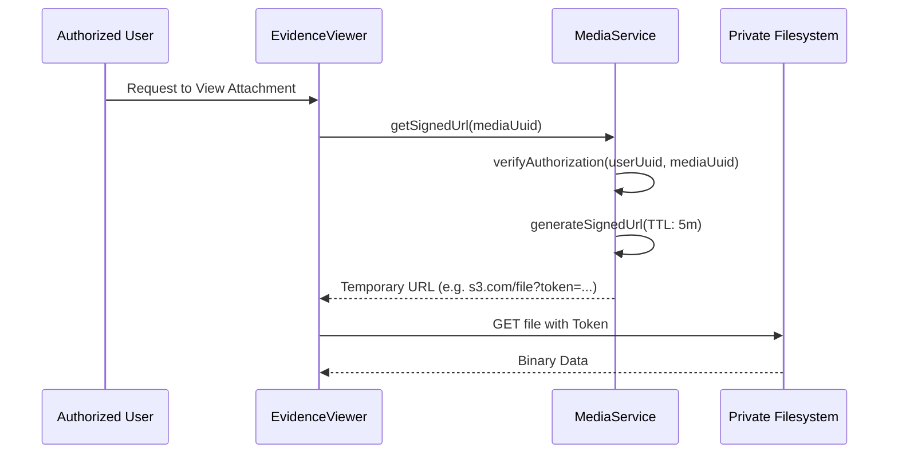

# Application Blueprint: Forensic Evidence (BP-OPR-F404)

**Blueprint ID**: `BP-OPR-F404` | **Requirement ID**: `SYRS-F-404` | **Scope**:
`Vocational Telemetry`

---

## 1. Strategic Context

- **Spec Alignment**: This blueprint authorizes the digital proof mechanism required to satisfy
  **[SYRS-F-404]** (Forensic Evidence).
- **Objective**: Establish a secure repository for media serving as technical proof of activity
  execution.
- **Rationale**: Digital evidence provides high-fidelity assurance that journals correspond to
  real-world actions, secured by cryptographic tokens.

---

## 2. Logic & Architecture (Systemic View)

### 2.1 Evidence Sovereignty

- **Private Storage**: All media stored on `private` disk.
- **UUID Referencing**: Modules MUST NOT store direct paths; only reference `media_id` (UUID).

### 2.2 System Interaction Diagram (Exposure Flow)

### 2.3 Service Contract Specifications

- **`Modules\Media\Services\Contracts\MediaService`**: Central provider for ingestion, signing, and
  lifecycle management.

---

## 3. Presentation Strategy (User Experience View)

### 3.1 UX Workflow

- **Mobile Capture**: "Snap & Attach" interface for mobile cameras.
- **Thumbnail Preview**: Rapid visual audit via secure thumbnails.

### 3.2 Interface Design

- **Evidence Carousel**: Component (`media::evidence-carousel`) for viewing multiple proofs.

---

## 4. Verification Strategy (V&V View)

### 4.1 Unit Verification

- **PII Masking**: Ensure metadata (exif) doesn't leak in logs.
- **Token Expiry**: Verify URL signature TTL logic.

### 4.2 Feature Validation

- **Direct Access Audit**: Guessing public URL returns `404/403`.
- **Tamper Test**: Modifying signed URL parameters results in rejection.

---

## 5. Compliance & Standardization (Integrity View)

### 5.1 Privacy & Security

- **Metadata Stripping**: Automatically strip GPS from photos unless verified.
- **Encryption-at-Rest**: Sensitive docs encrypted before storage.

---

### 5.2 Mandatory 3S Audit Alignment

To guarantee architectural integrity and prevent systemic entropy, this implementation MUST strictly
adhere to the project's 3S Protocol:

- **S1 (Secure)**: Every state-altering method within the Service Layer MUST explicitly invoke
  `Gate::authorize()` prior to execution to prevent IDOR and Broken Access Control. Sensitive PII
  fields MUST utilize the `encrypted` cast.
- **S2 (Sustain)**: All files MUST declare `strict_types=1`. Virtual attributes MUST be implemented
  using PHP 8.4 Property Hooks. All user-facing strings and exceptions MUST be localized via
  `__('key')`. Every public method MUST contain professional PHPDoc explaining its intent.
- **S3 (Scalable)**: Cross-module interactions MUST use **Contract-First** dependency injection
  (Interfaces). All domain models MUST implement `HasUuid` (and `HasStatus`, `HasAcademicYear` where
  applicable). Asynchronous side-effects MUST utilize Domain Events with lightweight, UUID-only
  payloads.

## 6. Documentation Strategy (Knowledge View)

### 6.1 Engineering Record

- **Infrastructure Guide**: Update `docs/dev/security.md` for private storage policy.

### 6.2 Stakeholder Manuals

- **Troubleshooting**: Update `docs/wiki/daily-monitoring.md` for upload issues.

---

## 7. Actionable Implementation Path

1.  **Issue #Media1**: Configure `private` filesystem disk and S3 integration.
2.  **Issue #Media2**: Implement `MediaService` with Signed URL generation.
3.  **Issue #Media3**: Build the "Snap & Attach" mobile UI component.
4.  **Issue #Media4**: Develop the metadata-stripping middleware for uploads.

---

## 8. Exit Criteria & Quality Gates

- **Acceptance Criteria**: Ingestion operational; Signed URLs verified; Private disk enforced.
- **Verification Protocols**: 100% pass rate in media test suite.
- **Quality Gate**: Audit confirms zero "Direct-Exposure" vulnerabilities.

---

_Application Blueprints prevent architectural decay and ensure continuous alignment with the
foundational specifications._
