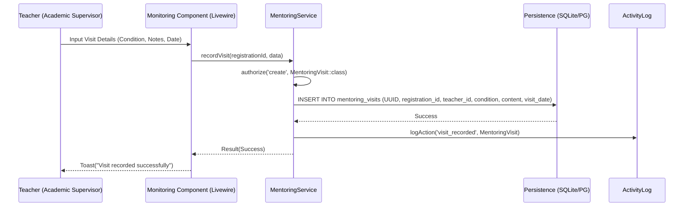

# Application Blueprint: On-site Monitoring (BP-OPR-F405)

**Blueprint ID**: `BP-OPR-F405` | **Requirement ID**: `SYRS-F-405` | **Scope**:
`Operational Monitoring`

---

## 1. Strategic Context

- **Spec Alignment**: This blueprint authorizes the formal documentation mechanism for physical site
  visits required to satisfy **[SYRS-F-405]** (On-site Monitoring).
- **Objective**: Establish a systematic framework for Academic Supervisors (Teachers) to record
  their monitoring activities at industrial placement locations, ensuring institutional presence and
  qualitative evaluation of student conditions.
- **Rationale**: Physical visits are a cornerstone of vocational quality assurance. By formalizing
  these visits as auditable system records, we capture critical "ground truth" data that cannot be
  fully reflected in student-submitted journals.

---

## 2. Logic & Architecture (Systemic View)

### 2.1 The Mentoring Visit Entity

- **Domain Module**: This logic is encapsulated within the `Mentor` module.
- **Model**: `Modules\Mentor\Models\MentoringVisit`.
- **Data Invariants**: Every record MUST capture:
    - **Context**: Student Registration UUID and Teacher UUID.
    - **Temporal**: Exact Date of Visit.
    - **Qualitative**: Student Condition (Enum: `Excellent`, `Good`, `Fair`, `Poor`) and detailed
      Monitoring Notes.

### 2.2 System Interaction Diagram (Process Flow)

### 2.3 Persistence Specification (Schema)

| Column            | Type        | Index   | Nullable | Description                                    |
| :---------------- | :---------- | :------ | :------- | :--------------------------------------------- |
| `id`              | `UUID`      | Primary | No       | Unique identifier for the visit record.        |
| `registration_id` | `UUID`      | Indexed | No       | Link to the student's internship registration. |
| `teacher_id`      | `UUID`      | Indexed | No       | The ID of the supervisor performing the visit. |
| `visit_date`      | `Date`      | Indexed | No       | The calendar date when the visit occurred.     |
| `condition`       | `Enum`      | No      | No       | (excellent, good, fair, poor)                  |
| `content`         | `Text/JSON` | No      | No       | Qualitative monitoring notes and feedback.     |
| `created_at`      | `Timestamp` | No      | No       | Audit timestamp.                               |

### 2.4 Security & Accountability

- **Authorization Invariant**: Only the `Teacher` explicitly assigned to a student registration is
  authorized to create or modify a visit record for that student.
- **Scoping**: All visit queries are automatically filtered by the `HasAcademicYear` global scope to
  ensure cohort isolation.

---

## 3. Presentation Strategy (User Experience View)

### 3.1 UX Workflow

- **Mobile Visit Entry**: A streamlined mobile interface allowing Teachers to log visit details
  while still at the industrial location.
- **Student Condition Pulse**: Visual indicators on the Teacher's dashboard highlighting students
  who have not received a visit within the mandated period (e.g., "Due for Visit").

### 3.2 Interface Design

- **Monitoring Log Component**: A chronological view of all visits for a specific student, providing
  a "Guidance History" for academic coordinators.
- **Form Component**: `mentor::livewire.visit-editor` (Functional Livewire component).

---

## 4. Verification Strategy (V&V View)

### 4.1 Unit Verification

- **Enum Integrity**: Unit tests ensuring that only valid student condition enums are accepted by
  the persistence layer.
- **Scoping Guard**: Verification that the `HasAcademicYear` concern correctly partitions visit
  data.

### 4.2 Feature Validation

- **Authorization Audit**: Integration tests verifying that a Teacher attempting to log a visit for
  a student in another department receives a `403 Forbidden` response.
- **Validation Audit**: Tests ensuring that empty notes or missing condition ratings trigger
  appropriate validation errors.

### 4.3 Architecture Verification

- **Model Invariants**: Pest Arch tests ensuring that `MentoringVisit` implements `HasUuid` and
  `InteractsWithActivityLog`.

---

## 5. Compliance & Standardization (Integrity View)

### 5.1 Auditability

- **Forensic Records**: Every visit record creation MUST result in an `ActivityLog` entry capturing
  the complete state of the visit for future verification.

---

### 5.2 Mandatory 3S Audit Alignment

To guarantee architectural integrity and prevent systemic entropy, this implementation MUST strictly
adhere to the project's 3S Protocol:

- **S1 (Secure)**: Every state-altering method within the Service Layer MUST explicitly invoke
  `Gate::authorize()` prior to execution to prevent IDOR and Broken Access Control. Sensitive PII
  fields MUST utilize the `encrypted` cast.
- **S2 (Sustain)**: All files MUST declare `strict_types=1`. Virtual attributes MUST be implemented
  using PHP 8.4 Property Hooks. All user-facing strings and exceptions MUST be localized via
  `__('key')`. Every public method MUST contain professional PHPDoc explaining its intent.
- **S3 (Scalable)**: Cross-module interactions MUST use **Contract-First** dependency injection
  (Interfaces). All domain models MUST implement `HasUuid` (and `HasStatus`, `HasAcademicYear` where
  applicable). Asynchronous side-effects MUST utilize Domain Events with lightweight, UUID-only
  payloads.

## 6. Documentation Strategy (Knowledge View)

### 6.1 Engineering Record

- **Developer Guide**: Update `modules/Mentor/README.md` to include the `mentoring_visits` schema
  and service contract definitions.

### 6.2 Stakeholder Manuals

- **Staff Guide**: Update `docs/wiki/daily-monitoring.md` to document the physical visit recording
  process for Teachers.

---

## 7. Actionable Implementation Path

1.  **Issue #Visit1**: Migration for `mentoring_visits` table with indexed UUIDs and Enum.
2.  **Issue #Visit2**: Implementation of `MentoringVisit` model with `HasUuid` and
    `HasAcademicYear`.
3.  **Issue #Visit3**: Construction of `MentoringService::recordVisit` with Policy enforcement.
4.  **Issue #Visit4**: Development of the `VisitEditor` Livewire component for mobile-optimized
    entry.

---

## 8. Exit Criteria & Quality Gates

- **Acceptance Criteria**: Visit recording operational; Authorization enforced; Academic scoping
  verified.
- **Verification Protocols**: 100% pass rate in the monitoring and guidance test suite.
- **Quality Gate**: Institutional audit confirms that visit records accurately reflect Teacher field
  activities.

---

_Application Blueprints prevent architectural decay and ensure continuous alignment with the
foundational specifications._
