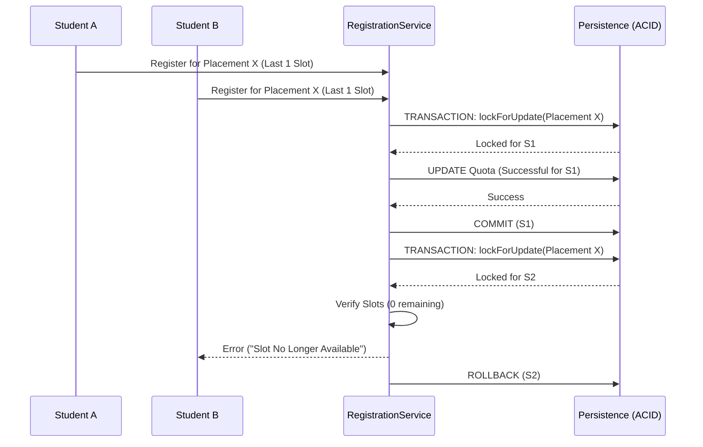

# Application Blueprint: Slot Atomic Integrity (BP-PLC-F302)

**Blueprint ID**: `BP-PLC-F302` | **Requirement ID**: `SYRS-F-302` | **Scope**:
`Internship Lifecycle`

---

## 1. Strategic Context

- **Spec Alignment**: This blueprint authorizes the atomic industry placement availability and quota
  management required to satisfy **[SYRS-F-302]** (Slot Atomic Integrity).
- **Objective**: Establish a concurrency-safe mechanism for managing industrial placement slots,
  ensuring no over-allocation even during high-volume registration periods.
- **Rationale**: Industrial partners provide finite slots. Race conditions must be prevented at the
  database level to maintain institutional credibility and partnership integrity.

---

## 2. Logic & Architecture (Systemic View)

### 2.1 Transactional Quota Orchestration

Slot allocation MUST be atomic:

1.  **Lock**: Apply `lockForUpdate()` on the `Placement` record.
2.  **Verify**: Recalculate availability based on `Active/Pending` registrations.
3.  **Decrement**: If slots > 0, bind the student registration.

### 2.2 System Interaction Diagram (Concurrent Flow)

### 2.3 Data Architecture Invariants

- **The One-Placement Law**: Unique constraint preventing a student from holding >1 active/pending
  registration in the same cycle.
- **Standard Methods**: `InternshipPlacement::remaining_slots` MUST compute dynamically from
  registration counts.

---

## 3. Presentation Strategy (User Experience View)

### 3.1 UX Workflow

- **Live Counters**: Catalog displays real-time "Slots Available" with async refreshing.
- **Panic Protection**: Graceful "Slot Taken" alert if availability changes during view.

### 3.2 Interface Design

- **Slot Pulse**: Visual badge (`ui::slot-indicator`) showing quota pressure (Green/Yellow/Red).

---

## 4. Verification Strategy (V&V View)

### 4.1 Unit Verification

- **Calculation Logic**: Unit tests for the standard method across all status permutations.

### 4.2 Feature Validation

- **Concurrency Stress Test**: Integration tests simulating simultaneous attempts for a single slot.
- **Atomic Rollback**: Verification that failed registration leaves quota unchanged.

---

## 5. Compliance & Standardization (Integrity View)

### 5.1 Data Consistency

- **Indexed UUIDs**: Ensuring performant locking during heavy concurrent transactions.

---

### 5.2 Mandatory 3S Audit Alignment

To guarantee architectural integrity and prevent systemic entropy, this implementation MUST strictly
adhere to the project's 3S Protocol:

- **S1 (Secure)**: Every state-altering method within the Service Layer MUST explicitly invoke
  `Gate::authorize()` prior to execution to prevent IDOR and Broken Access Control. Sensitive PII
  fields MUST utilize the `encrypted` cast.
- **S2 (Sustain)**: All files MUST declare `strict_types=1`. Virtual attributes MUST be implemented
  using explicit typing and standard methods. All user-facing strings and exceptions MUST be localized via
  `__('key')`. Every public method MUST contain professional PHPDoc explaining its intent.
- **S3 (Scalable)**: Cross-module interactions MUST use **Contract-First** dependency injection
  (Interfaces). All domain models MUST implement `HasUuid` (and `HasStatus`, `HasAcademicYear` where
  applicable). Asynchronous side-effects MUST utilize Domain Events with lightweight, UUID-only
  payloads.

## 6. Documentation Strategy (Knowledge View)

### 6.1 Engineering Record

- **Architecture**: Document the "One-Placement Law" and locking strategy in
  `../system-architecture.md`.

### 6.2 Stakeholder Manuals

- **Admin Guide**: Update `docs/wiki/enrollment-matching.md` to explain quota management.

---

## 7. Actionable Implementation Path

1.  **Issue #Slot1**: Implement `lockForUpdate` logic in `RegistrationService::register`.
2.  **Issue #Slot2**: Create the `remaining_slots` standard method on `InternshipPlacement`.
3.  **Issue #Slot3**: Develop the concurrent stress test suite (Pest).
4.  **Issue #Slot4**: Build the Livewire "Live Counter" component.

---

## 8. Exit Criteria & Quality Gates

- **Acceptance Criteria**: Locking operational; Over-allocation impossible; Counters verified.
- **Verification Protocols**: 100% pass rate in the concurrency test suite.
- **Quality Gate**: Stress test confirms zero "Phantom Registrations" under high load.

---

_Application Blueprints prevent architectural decay and ensure continuous alignment with the
foundational specifications._
