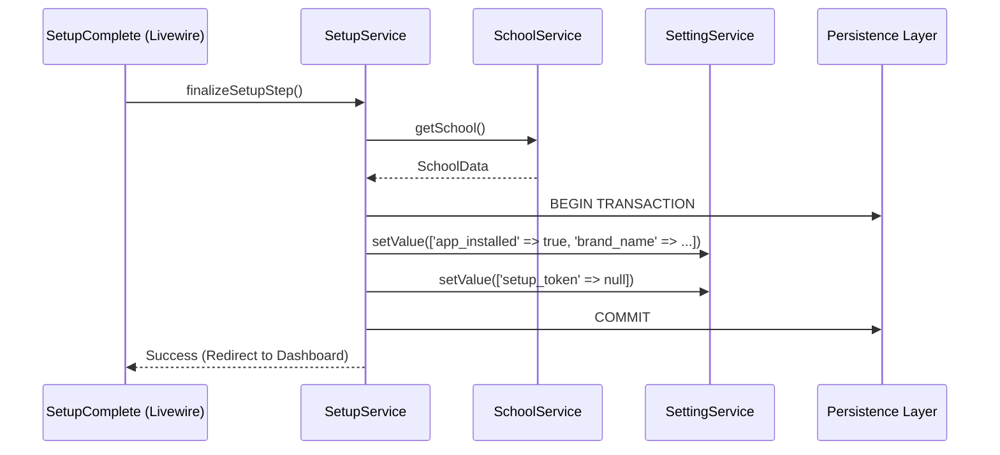

# Application Blueprint: Installation Wizard (BP-SYS-F101)

**Blueprint ID**: `BP-SYS-F101` | **Requirement ID**: `SYRS-F-101` | **Scope**: `System Core`

---

## 1. Strategic Context

- **Spec Alignment**: This blueprint authorizes the construction of the sequential 8-step wizard 
  required to satisfy **[SYRS-F-101]** (Installation Wizard) and **[SYRS-C-004]** (Branding).
- **Objective**: Establish a secure, deterministic, and auditable bootstrapping mechanism ensuring 
  the system environment is fully validated before any domain operations are permitted.
- **Rationale**: A Modular Monolith requires a coordinated _Cold Start_ to initialize shared state, 
  system settings, institutional identity, and foundational roles. Formalizing this process prevents 
  inconsistent application states and eliminates non-deterministic manual configuration.

---

## 2. Logic & Architecture (Systemic View)

### 2.1 Core Orchestration Services (`Setup` Module)

- **`Modules\Setup\Services\Contracts\InstallerService`**: Technical orchestrator responsible for 
  the file-system and database-level initialization (Env, Key, Migrations, Seeders).
- **`Modules\Setup\Services\Contracts\SetupService`**: State-machine orchestrator responsible for 
  tracking wizard progression and verifying institutional record creation.
- **`Modules\Setup\Services\Contracts\SystemAuditor`**: Diagnostic engine for pre-flight 
  validation (PHP 8.4+, Extensions, Writable Directories, DB Connection).

### 2.2 Cross-Module Service Contracts

To satisfy **SYRS-NF-601** (Modular Isolation), the `Setup` module interacts with domain modules 
exclusively via their public interfaces:

| Step | Target Module | Service Contract (Interface) | Responsibility |
| :--- | :--- | :--- | :--- |
| 3 | `School` | `SchoolService` | Create institutional identity & branding. |
| 4 | `User` | `SuperAdminService` | Create root user with universal access. |
| 5 | `Department` | `DepartmentService` | Initialize the primary academic unit. |
| 6 | `Internship` | `InternshipService` | Configure the first operational cycle. |
| 7 | `Setting` | `SettingService` | Persist global system configurations. |

### 2.3 System Interaction Diagram (Atomic Finalization)

---

## 3. Orchestration Sequence (8-Step State Machine)

The wizard operates as a strict linear state machine. Completion is persisted via `SettingService` 
using the key pattern `setup_step_{name}`.

1.  **Welcome** (`SetupWelcome`): Initialize session and verify `app_installed = false`.
2.  **Environment Audit** (`EnvironmentSetup`): Validate PHP 8.4+ and mandatory extensions.
3.  **School Identity** (`SchoolSetup`): Define the authoritative institution.
4.  **Super-Admin Account** (`AccountSetup`): link to `BP-ID-F201` for encrypted profile creation.
5.  **Primary Department** (`DepartmentSetup`): Establish the first academic boundary.
6.  **Internship Program** (`InternshipSetup`): Set the initial vocational parameters.
7.  **System Configuration** (`SystemSetup`): Finalize SMTP and technical invariants.
8.  **Completion & Lockdown** (`SetupComplete`): Atomic promotion to `installed` state.

---

## 4. Presentation Strategy (User Experience View)

### 4.1 UX Workflow (SYRS-NF-401)
- **Navigation**: Prev/Next buttons gated by step validation (`disableNextStep`).
- **Feedback**: Real-time diagnostic reporting during the Environment Audit.

### 4.2 Layout Architecture
- **Dedicated Layout**: `setup::components.layouts.setup` using the Emerald Green accent.
- **Isolation**: Minimalist design to prevent "Information Leak" before authentication is active.

---

## 5. Verification & Validation (V&V) Strategy (Quality View)

To satisfy **SYRS-NF-701** (3S Audit) and **SYRS-NF-702** (Coverage), the implementation must pass 
a multi-tiered verification suite.

### 5.1 Unit Verification (Behavioral Correctness)
- **`SystemAuditor` Logic**: 100% path coverage for all environmental diagnostics (PHP, extensions, 
  permissions). Must test both 'Success' and 'Explicit Failure' scenarios for each check.
- **`InstallerService` Idempotency**: Verify that `runMigrations` and `runSeeders` can be 
  re-executed without system corruption or duplicate record creation.
- **`SetupService` Invariants**: Test state transition logic (Step N to N+1) and verify that 
  invalid step requests are rejected.

### 5.2 Integration & Security Verification
- **State Persistence Audit**: Verify that `setup_step_*` settings are correctly persisted across 
  requests and cleaned up upon finalization.
- **Transactional Rollback**: Simulate a failure during Step 8 (`finalizeSetupStep`) and verify 
  that the database state reverts and `app_installed` remains `false`.
- **Middleware Lockdown**: Automated tests ensuring that `ProtectSetupRoute` returns `403` or 
  redirects when accessed via an unauthenticated session or post-installation.
- **Input Sanitization**: 100% validation coverage for all form inputs in Steps 3-7 to prevent 
  XSS and Injection.

### 5.3 Architecture Enforcement (Pest Arch)
- **Modular Isolation**: Verify that `Modules\Setup` has zero direct dependencies on concrete 
  models from other modules (e.g., `Modules\User\Models\User`).
- **Strict Typing**: Automated scan for `declare(strict_types=1)` and full method signatures.
- **Service Invariant**: Ensure all business logic resides in `src/Services` and not in Livewire 
  components.

---

## 6. Compliance & Standardization (Integrity View)

### 6.1 Branding & Identity (SYRS-C-004)
The finalization step MUST synchronize the `brand_name` setting with the institutional name 
created in Step 3, while preserving the immutable `app_name` (Internara).

### 6.2 Internationalization (SYRS-NF-403)
All labels, exceptions, and validation messages MUST utilize translation keys:
- `setup::wizard.{step}.title`
- `setup::exceptions.{type}`

---

## 7. Documentation & Traceability Strategy (Knowledge View)

To satisfy **ISO/IEC 12207** (Documentation Process) and the **3S Doctrine**, the following 
artifacts must be established and maintained.

### 7.1 Engineering Records (Technical Documentation)
- **Module README**: Update `modules/Setup/README.md` to document the internal orchestration 
  logic, installer contracts, and custom middleware functionality.
- **Service Catalog**: Every method in the `InstallerService` and `SetupService` MUST contain 
  professional PHPDoc documenting:
    - `@throws` clauses for all handled exceptions.
    - `@param` and `@return` types.
    - Architectural rationale for complex state transitions.
- **ADR Synchronization**: Record any deviations from the standard installation flow in the 
  Architectural Decision Record (ADR) registry.

### 7.2 Stakeholder Documentation (User Knowledge)
- **Institutional Walkthrough**: Update `docs/wiki/installation-guide.md` to provide a 
  non-technical, step-by-step manual for school administrators.
- **Environmental Prerequisites**: Maintain an authoritative table of required PHP extensions and 
  directory permissions for on-premise deployments.
- **Post-Installation Audit**: Provide a checklist for verifying institutional identity and 
  Super-Admin access post-setup.

### 7.3 Traceability Artifacts
- **Requirement Mapping**: Ensure the `docs/software-roadmap.md` reflects the current mapping 
  from `SYRS-F-101` to this blueprint.
- **V&V Evidence**: Link the results of the 3S Audit and Test Coverage reports to the 
  `verification-and-validation-report.md`.

---

## 8. Mandatory 3S Audit Alignment

### S1 — Secure
- **Authorization**: Every service method MUST invoke `Gate::authorize()`.
- **Atomicity**: `finalizeSetupStep()` MUST execute within a database transaction.
- **Lockdown**: `ProtectSetupRoute` middleware must enforce the installation invariant.

### S2 — Sustain
- **Types**: Mandatory `declare(strict_types=1)` and strict property typing.
- **Documentation**: Professional PHPDoc for all service contracts.
- **Clean Logic**: No hard-coded "Magic Numbers" for steps or settings.

### S3 — Scalable
- **Interface-First**: Interaction with domain modules ONLY via Service Contracts.
- **Identity**: All created records (User, School, Dept) MUST use UUID v4.
- **Events**: Completion triggers `SetupFinalized` domain event for async cleanup.

---

## 9. Actionable Implementation Path

1.  **Issue #Setup-1**: Implement `SystemAuditor` with PHP 8.4 diagnostic logic.
2.  **Issue #Setup-2**: Construct `InstallerService` with transaction-safe migration logic.
3.  **Issue #Setup-3**: Develop the 8-step Livewire wizard with state persistence.
4.  **Issue #Setup-4**: Implement `ProtectSetupRoute` middleware for permanent lockdown.
5.  **Issue #Setup-5**: Finalize `SetupService` with the `brand_name` vs `app_name` invariant.

---

## 10. Exit Criteria & Quality Gates

- **Acceptance**: Successful 8-step walkthrough results in a fully operational administrative 
  dashboard.
- **Verification**: 100% pass rate in the `Setup` module test suite.
- **Quality Gate**: Security audit confirms that `/setup` is inaccessible post-installation.

---

_Application Blueprints preserve architectural discipline and ensure that the project's engineering 
doctrine is maintained across all systemic evolutions._
