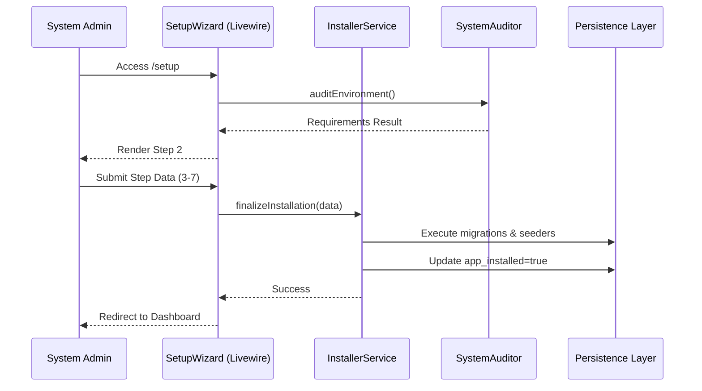

# Application Blueprint: Installation Wizard (BP-SYS-F101)

**Blueprint ID**: `BP-SYS-F101` **Requirement ID**: `SYRS-F-101` **Scope**: `System Core`

---

## 1. Strategic Context

- **Spec Alignment**: This blueprint authorizes the construction of the sequential 8-step wizard
  required to satisfy **[SYRS-F-101]** (Installation Wizard).
- **Objective**: Establish a secure, deterministic, and auditable bootstrapping mechanism ensuring
  the system environment is fully validated before any domain operations are permitted.
- **Rationale**: A Modular Monolith requires a coordinated _Cold Start_ to initialize shared state,
  system settings, institutional identity, and foundational roles. Formalizing this process prevents
  inconsistent application states and eliminates non-deterministic manual configuration.

---

## 2. Logic & Architecture (Systemic View)

### 2.1 Setup Process Manager (`Setup` Module)

- **`Modules\Setup\Services\Contracts\InstallerServiceInterface`** Primary orchestration contract
  responsible for executing the installation lifecycle.

- **`Modules\Setup\Services\InstallerService`** Concrete implementation responsible for:
    - Executing database migrations
    - Running initial seeders
    - Setting the `app_installed` flag
    - Initializing foundational system identities

- **`Modules\Setup\Support\SystemAuditor`** Stateless utility responsible for pre-flight environment
  validation:
    - PHP version compliance
    - Required PHP extensions
    - Directory permissions (storage, cache, bootstrap)
    - Database connectivity validation

> No Data Transfer Objects (DTOs) are introduced. Data exchange between layers is handled via
> validated structured arrays or internal Value Objects where necessary, without adding a DTO
> abstraction layer.

---

### 2.2 Cross-Module Communication Strategy (Interface-First)

To prevent tight coupling without enforcing impractical 100% physical isolation:

- The `Setup` module **must not access domain models directly**.
- Cross-module communication is performed strictly through **public Service Contracts
  (Interfaces)**.
- Each domain module exposes its own initialization contract.

Example:

```php
interface SchoolInitializerInterface
{
    public function initialize(array $data): void;
}
```

Bindings are resolved through each module’s Service Provider.

This approach ensures:

- Setup remains the system-level orchestrator.
- Domain modules retain internal autonomy.
- No DTO boundary layer is required.
- Architectural clarity without excessive modular rigidity.

---

### 2.3 System Interaction Diagram



---

## 3. Orchestration Sequence (8-Step State Machine)

The wizard operates as a strict linear state machine to prevent partial installations:

1. **Welcome** — Initialize setup session.
2. **Environment Audit** — Validate system prerequisites.
3. **School Identity** — Establish institutional identity.
4. **Super-Admin Account** — Create primary system administrator.
5. **Primary Department** — Initialize the core academic department.
6. **Internship Program** — Configure initial internship parameters.
7. **System Configuration** — Finalize mail and system-level settings.
8. **Completion & Lockdown** — Persist installation state and disable setup routes.

### State Enforcement Rules

- Each step verifies completion of all previous steps.
- Access is controlled via Signed URLs.
- Step skipping results in `403 Forbidden`.
- Finalization occurs within a single transactional boundary in `InstallerService`.

---

## 4. Presentation Strategy (User Experience View)

### 4.1 UX Workflow

- Strict linear progression (no arbitrary navigation).
- Real-time feedback for environment diagnostics.
- Clear remediation guidance for failed prerequisites.

### 4.2 Layout Architecture

- Dedicated layout: `setup::layouts.setup`
- Fully isolated from the main administrative shell.
- Progressive disclosure: only the active step form is rendered.

---

## 5. Verification Strategy (Validation & Verification View)

### 5.1 Unit Verification

- 100% branch coverage for `SystemAuditor`.
- `InstallerService` must be:
    - Idempotent
    - Transaction-safe
    - Fail-fast on invalid preconditions

### 5.2 Feature Validation

- Direct access to any step beyond current state returns `403`.
- Re-accessing `/setup` when `app_installed = true` redirects to dashboard.
- All form submissions must validate:
    - CSRF token
    - Turnstile / Honeypot anti-bot mechanisms

### 5.3 Architecture Verification

- `Setup` module may depend on Contracts from other modules.
- Concrete implementations from domain modules must never be referenced.
- Static analysis enforces interface-only dependency injection.

---

## 6. Compliance & Standardization (Integrity View)

### 6.1 Internationalization (i18n)

- All user-facing strings resolved via `__('setup::messages.key')`.
- No hard-coded display strings permitted.

### 6.2 Security-by-Design

Upon Step 8 completion:

- `/setup` routes are permanently disabled.
- `EnsureNotInstalled` middleware enforces installation lock invariant.
- Installation flag is stored in persistent configuration.

---

## 6.3 Mandatory 3S Audit Alignment

### S1 — Secure

- Every state-altering method must invoke `Gate::authorize()`.
- Sensitive fields use `encrypted` casts.
- `InstallerService` executes within a database transaction.
- No partial commits permitted.

### S2 — Sustain

- `declare(strict_types=1);` required in all files.
- All public methods must contain professional PHPDoc.
- No magic strings.
- Exceptions and validation errors must be localized.

### S3 — Scalable

- Interface-first cross-module communication.
- Domain models implement UUID identity.
- Asynchronous side-effects handled via Domain Events with UUID-only payloads.
- No direct cross-module model hydration.

---

## 7. Documentation Strategy (Knowledge View)

### 7.1 Engineering Record

Update:

```
modules/Setup/README.md
```

Must document:

- InstallerService contract
- Cross-module binding strategy
- Environment audit checklist
- Locking mechanism

### 7.2 Stakeholder Installation Guide

Update:

```
docs/wiki/installation.md
```

Must include:

- Step-by-step installation walkthrough
- Troubleshooting matrix
- Environment requirement table
- Post-install validation checklist

---

## 8. Actionable Implementation Path

1. **Issue #Setup1** Implement `SystemAuditor` (environment validation engine).

2. **Issue #Setup2** Implement `InstallerServiceInterface` and concrete implementation.

3. **Issue #Setup3** Develop multi-step Livewire components.

4. **Issue #Setup4** Implement Signed URL state tracking.

5. **Issue #Setup5** Implement Setup Lock middleware.

---

## 9. Exit Criteria & Quality Gates

### Acceptance Criteria

- All 8 wizard steps function correctly.
- Environment audit passes.
- Super-Admin account successfully created.
- Setup routes permanently locked.

### Verification Protocols

- 100% pass rate in Setup module test suite.
- Static analysis reports zero high-severity violations.

### Quality Gate

`InstallerService` must be free from:

- Partial commits
- Hidden dependencies
- Direct domain model coupling
- Uncontrolled side-effects

---

_Application Blueprints preserve architectural discipline and prevent systemic entropy in long-lived
systems._
