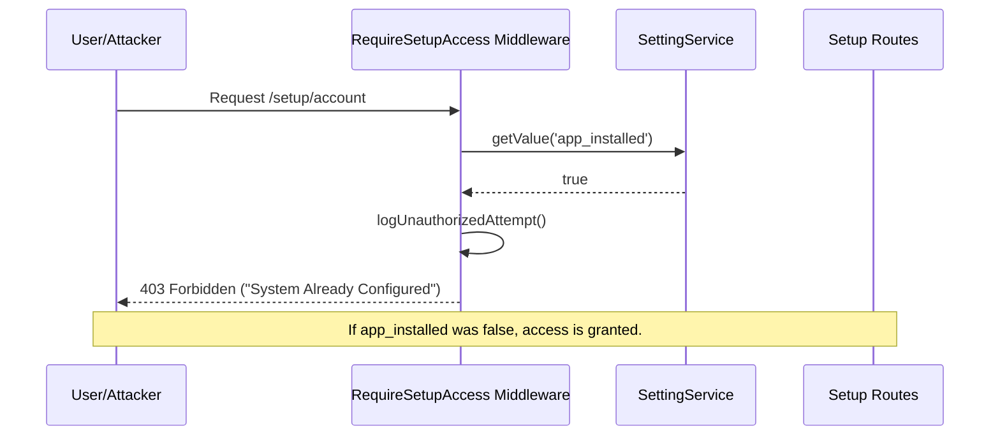

# Application Blueprint: Setup Protection (BP-SYS-F102)

**Blueprint ID**: `BP-SYS-F102` | **Requirement ID**: `SYRS-F-102` | **Scope**: `System Core`

---

## 1. Strategic Context

- **Spec Alignment**: This blueprint authorizes the construction of the "Single-Install" security
  invariant required to satisfy **[SYRS-F-102]** (Setup Protection).
- **Objective**: Prevent unauthorized re-initialization of the system by physically and logically
  locking all setup routes once the application has achieved its `installed` state.
- **Rationale**: Re-running an installer on a live system is a catastrophic security risk that could
  lead to data wiping, administrative account takeover, or configuration corruption. A permanent,
  non-bypassable lock is mandatory.

---

## 2. Logic & Architecture (Systemic View)

### 2.1 The Security Gate

- **`Modules\Setup\Http\Middleware\RequireSetupAccess`**: The authoritative Policy Enforcement Point
  (PEP) that audits the system state on every setup-related request.
- **State Resolution**: The middleware MUST resolve the `app_installed` state via the
  `SettingService` to ensure centralized control.

### 2.2 System Interaction Diagram (Gate Flow)

### 2.3 Invariants & Rules

- **Status Locking**: If `setting('app_installed')` is `true`, any request to the `/setup/*` route
  group MUST be immediately terminated with a `403 Forbidden` response.
- **Signed URL Integrity**: Transition between setup steps MUST utilize Laravel's Signed URLs to
  prevent URL parameter manipulation.

---

## 3. Presentation Strategy (User Experience View)

### 3.1 UX Workflow

- **Graceful Rejection**: Users attempting to access `/setup` after installation should be
  redirected to the login page with a secure "System already configured" notice.

### 3.2 Interface Design

- **Error State**: Utilization of the standard design system's alert components to communicate the
  lockdown state without exposing internal system metadata.

---

## 4. Verification Strategy (V&V View)

### 4.1 Unit Verification

- **Setting Resolution**: Verification that `RequireSetupAccess` correctly identifies the boolean
  state from the `SettingService`.

### 4.2 Feature Validation

- **Boundary Audit**: Integration tests verifying that 100% of routes under the `setup::` namespace
  return `403` once the installation is finalized.
- **Signature Tampering**: Security tests simulating tampered Signed URLs to ensure they are
  rejected.

### 4.3 Architecture Verification

- **Middleware Sovereignty**: Pest Arch tests ensuring that the setup protection logic remains
  encapsulated within the `Setup` module.

---

## 5. Compliance & Standardization (Integrity View)

### 5.1 Security-by-Design

- **Defense in Depth**: The system MUST also disable the `setup` service provider in production
  environments as a secondary layer.
- **Activity Logging**: Every unauthorized attempt to access a locked setup route MUST be recorded
  in the `ActivityLog`.

---

### 5.2 Mandatory 3S Audit Alignment

To guarantee architectural integrity and prevent systemic entropy, this implementation MUST strictly
adhere to the project's 3S Protocol:

- **S1 (Secure)**: Every state-altering method within the Service Layer MUST explicitly invoke
  `Gate::authorize()` prior to execution to prevent IDOR and Broken Access Control. Sensitive PII
  fields MUST utilize the `encrypted` cast.
- **S2 (Sustain)**: All files MUST declare `strict_types=1`. Virtual attributes MUST be implemented
  using explicit typing and standard methods. All user-facing strings and exceptions MUST be localized via
  `__('key')`. Every public method MUST contain professional PHPDoc explaining its intent.
- **S3 (Scalable)**: Cross-module interactions MUST use **Contract-First** dependency injection
  (Interfaces). All domain models MUST implement `HasUuid` (and `HasStatus`, `HasAcademicYear` where
  applicable). Asynchronous side-effects MUST utilize Domain Events with lightweight, UUID-only
  payloads.

## 6. Documentation Strategy (Knowledge View)

### 6.1 Engineering Record

- **Security Policy**: Update `../conflict-resolution-policy.md` to document the setup-locking invariant as a core
  system security protocol.

### 6.2 Stakeholder Manuals

- **Troubleshooting**: Update `docs/wiki/installation.md` with instructions on how to manually reset
  the installation state via CLI.

---

## 7. Actionable Implementation Path

1.  **Issue #Guard1**: Create `RequireSetupAccess` middleware with `SettingService` dependency.
2.  **Issue #Guard2**: Register the middleware in the `Setup` module's route group.
3.  **Issue #Guard3**: Implement `app:reset-install` CLI command for authorized state reset.

---

## 8. Exit Criteria & Quality Gates

- **Acceptance Criteria**: Setup routes inaccessible after install; attempts logged; signed URLs
  verified.
- **Verification Protocols**: 100% pass rate in the setup security test suite.
- **Quality Gate**: Security audit confirms zero bypass vectors for the middleware.

---

_Application Blueprints prevent architectural decay and ensure continuous alignment with the
foundational specifications._
