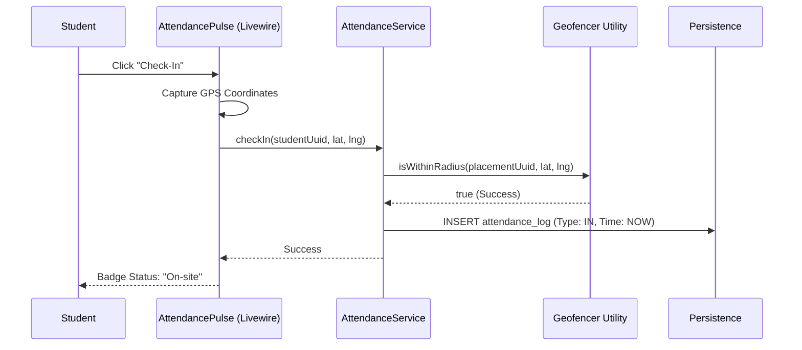

# Application Blueprint: Temporal Presence (BP-OPR-F401)

**Blueprint ID**: `BP-OPR-F401` | **Requirement ID**: `SYRS-F-401` | **Scope**: `Vocational Telemetry`

---

## 1. Strategic Context

- **Spec Alignment**: This blueprint authorizes the real-time presence tracking mechanism required to satisfy **[SYRS-F-401]** (Temporal Presence).
- **Objective**: Establish a high-fidelity attendance system that utilizes geofencing and temporal constraints to verify student presence at industrial placement locations.
- **Rationale**: Attendance is the primary metric for vocational participation. Using GPS-based geofencing and strict temporal windows ensures the integrity of vocational data for competency assessment.

---

## 2. Logic & Architecture (Systemic View)

### 2.1 The Geofence Invariant

- **Spatial Validation**: Requests MUST include student GPS coordinates (`lat`, `lng`).
- **Radius Audit**: Calculate Haversine distance between current location and `Placement` location. Reject if > 500m.

### 2.2 System Interaction Diagram (Attendance Flow)

### 2.3 Persistence Specification (Schema)

| Column | Type | Index | Nullable | Description |
| :--- | :--- | :--- | :--- | :--- |
| `id` | `UUID` | Primary | No | Log unique identifier. |
| `registration_id` | `UUID` | Indexed | No | Registration context. |
| `type` | `Enum` | No | No | (in, out) |
| `recorded_at` | `Timestamp` | Indexed | No | Event time. |
| `latitude` | `Decimal` | No | Yes | Captured for audit. |
| `longitude` | `Decimal` | No | Yes | Captured for audit. |

---

## 3. Presentation Strategy (User Experience View)

### 3.1 UX Workflow

- **Location Handshake**: Request browser permission on portal access.
- **Real-Time Map**: Display geofence boundary and student position.

### 3.2 Interface Design

- **Attendance Pulse**: Component (`attendance::live-status`) showing "On-site", "Out-of-Range", or "Checked-Out".

---

## 4. Verification Strategy (V&V View)

### 4.1 Unit Verification

- **Geofence Math**: Verify Haversine implementation for edge cases.
- **Temporal Logic**: Test `DateTime` immutable logic for log overlaps.

### 4.2 Feature Validation

- **Radius Breach**: Simulate check-in 501m from center (Must fail).
- **Time Warp Audit**: Ensure no retroactive check-ins.

---

## 5. Compliance & Standardization (Integrity View)

### 5.1 Privacy-by-Design

- **Transient Location**: Coordinates NOT stored unless resulting in success.

---

## 6. Documentation Strategy (Knowledge View)

### 6.1 Engineering Record

- **Developer Guide**: Update `modules/Attendance/README.md` for geofence algorithm.

### 6.2 Stakeholder Manuals

- **User Guide**: Update `docs/wiki/daily-monitoring.md` for check-in workflow.

---

## 7. Actionable Implementation Path

1.  **Issue #Attend1**: Implement `Geofencer` utility with Haversine formula.
2.  **Issue #Attend2**: Create `attendance_logs` migration and model.
3.  **Issue #Attend3**: Develop the `AttendancePulse` functional component.
4.  **Issue #Attend4**: Integrate geofence check into `AttendanceService`.

---

## 8. Exit Criteria & Quality Gates

- **Acceptance Criteria**: Geofencing functional; Windows enforced; Location handshake verified.
- **Verification Protocols**: 100% pass rate in attendance test suite.
- **Quality Gate**: Security audit confirms zero "Location-Spoofing" vulnerabilities.

---

_Application Blueprints prevent architectural decay and ensure continuous alignment with the foundational specifications._
