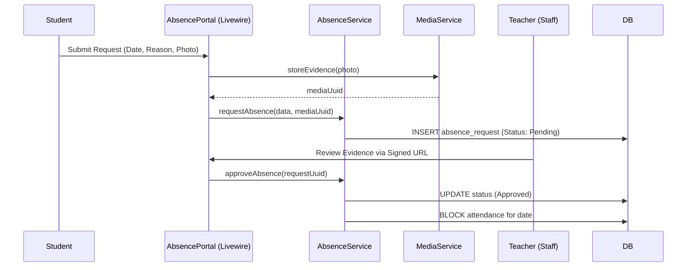

# Application Blueprint: Absence Orchestration (BP-OPR-F402)

**Blueprint ID**: `BP-OPR-F402` | **Requirement ID**: `SYRS-F-402` | **Scope**: `Vocational Telemetry`

---

## 1. Strategic Context

- **Spec Alignment**: This blueprint authorizes the management of authorized absences required to satisfy **[SYRS-F-402]** (Absence Orchestration).
- **Objective**: Establish an auditable workflow for student leave requests justified by digital evidence.
- **Rationale**: Students have legitimate reasons for absence (illness). Formalizing "Authorized Absences" ensures they are treated correctly in automated scoring and academic integrity audits.

---

## 2. Logic & Architecture (Systemic View)

### 2.1 The Absence State Machine

Requests follow a strict lifecycle:
1.  **Draft**: Created by student.
2.  **Pending**: Awaiting verification.
3.  **Approved**: Authorized; Check-In blocked for the date.
4.  **Rejected**: Unauthorized; counts as penalty.

### 2.2 System Interaction Diagram (Authorization Flow)

### 2.3 Functional Invariants

- **Conflict Prevention**: `AttendanceService` rejects `Check-In` if `Approved` absence exists for the date.
- **Evidence Mandate**: "Sick" category REQUIRES media attachment.

---

## 3. Presentation Strategy (User Experience View)

### 3.1 UX Workflow

- **Mobile Submission**: Streamlined form for photo evidence capture.
- **Supervisor Inbox**: Dedicated verification interface for Teachers.

### 3.2 Interface Design

- **Evidence Viewer**: Secure component using temporary signed URLs.

---

## 4. Verification Strategy (V&V View)

### 4.1 Unit Verification

- **Status Transitions**: Verify correct logging and authorization.
- **Evidence Validation**: Ensure "Sick" enforces `media_id`.

### 4.2 Feature Validation

- **Attendance Block**: Verify `AttendanceService` throws `ConflictException` on approved absence date.
- **Scoring Neutrality**: Ensure `ComplianceService` treats approved absences as neutral.

---

## 5. Compliance & Standardization (Integrity View)

### 5.1 Forensic Traceability

- **Audit Trail**: Capture `verified_by` UUID and rejection rationale.

---

## 6. Documentation Strategy (Knowledge View)

### 6.1 Engineering Record

- **Developer Guide**: Update `modules/Attendance/README.md` for absence lifecycle.

### 6.2 Stakeholder Manuals

- **Student Guide**: Update `docs/wiki/daily-monitoring.md` for submission process.

---

## 7. Actionable Implementation Path

1.  **Issue #Absence1**: Create `absence_requests` migration and model with `HasStatus`.
2.  **Issue #Absence2**: Implement `AbsenceService` logic.
3.  **Issue #Absence3**: Develop the mobile submission form component.
4.  **Issue #Absence4**: Build the Supervisor Review component with Secure Evidence Viewer.

---

## 8. Exit Criteria & Quality Gates

- **Acceptance Criteria**: Lifecycle functional; Conflicts blocked; Scoring neutrality verified.
- **Verification Protocols**: 100% pass rate in absence test suite.
- **Quality Gate**: Security audit confirms evidence protection via signed URLs.

---

_Application Blueprints prevent architectural decay and ensure continuous alignment with the foundational specifications._
