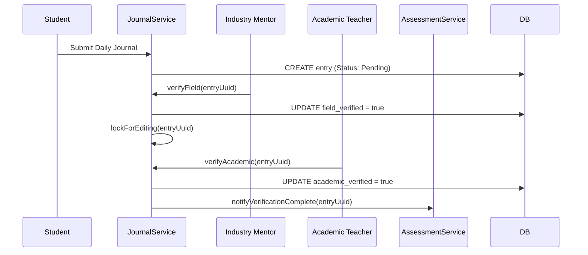

# Application Blueprint: Dual-Supervision Journals (BP-OPR-F403)

**Blueprint ID**: `BP-OPR-F403` | **Requirement ID**: `SYRS-F-403` | **Scope**: `Vocational Telemetry`

---

## 1. Strategic Context

- **Spec Alignment**: This blueprint authorizes the dual-verification protocol for daily journals required to satisfy **[SYRS-F-403]** (Dual-Supervision Journals).
- **Objective**: Establish an activity logging system where student records are validated by both industry and academic supervisors.
- **Rationale**: Journals are evidence of skill acquisition. Multi-party verification ensures academic integrity and industrial relevance.

---

## 2. Logic & Architecture (Systemic View)

### 2.1 The Multi-Party Verification Protocol

Entries MUST achieve two states:
1.  **Field Verified**: Confirmed by Industry Mentor.
2.  **Academic Verified**: Confirmed by Academic Teacher.

### 2.2 System Interaction Diagram (Verification Loop)

### 2.3 Functional Invariants

- **Immutability**: Locked for editing as soon as first verification occurs.
- **7-Day Window**: Rejects entries older than 7 days from activity date.

---

## 3. Presentation Strategy (User Experience View)

### 3.1 UX Workflow

- **Timeline Feed**: Chronological feed with verification status indicators.
- **Micro-Verification**: Rapid mobile actions for supervisors.

### 3.2 Interface Design

- **Journal Pulse**: Status widget (`journal::verification-status`) summarizing weekly progress.

---

## 4. Verification Strategy (V&V View)

### 4.1 Unit Verification

- **Metric Logic**: Verify responsiveness calculation (delays vs reaction times).
- **Property Hooks**: Ensure `is_verified` and `word_count` resolve correctly.

### 4.2 Feature Validation

- **Edit Lock Audit**: Verify verified journal returns `403` on update attempt.
- **Window Enforcement**: Server rejects entries older than 7 days.

---

## 5. Compliance & Standardization (Integrity View)

### 5.1 Vocational Traceability

- **Responsiveness KPI**: Automatically calculate delay between activity and submission.

---

## 6. Documentation Strategy (Knowledge View)

### 6.1 Engineering Record

- **Developer Guide**: Update `modules/Journal/README.md` for state machine logic.

### 6.2 Stakeholder Manuals

- **Supervisor Guide**: Update `docs/wiki/daily-monitoring.md` for mobile verification.

---

## 7. Actionable Implementation Path

1.  **Issue #Journal1**: Create `journal_entries` migration with dual-verification flags.
2.  **Issue #Journal2**: Implement `JournalService` with immutability guards.
3.  **Issue #Journal3**: Build the chronological Timeline feed component.
4.  **Issue #Journal4**: Develop the "7-day Window" validation middleware.

---

## 8. Exit Criteria & Quality Gates

- **Acceptance Criteria**: Dual-verification functional; Immutability enforced; Window active.
- **Verification Protocols**: 100% pass rate in journal test suite.
- **Quality Gate**: Audit confirms verification states cannot be manipulated via IDOR.

---

_Application Blueprints prevent architectural decay and ensure continuous alignment with the foundational specifications._
