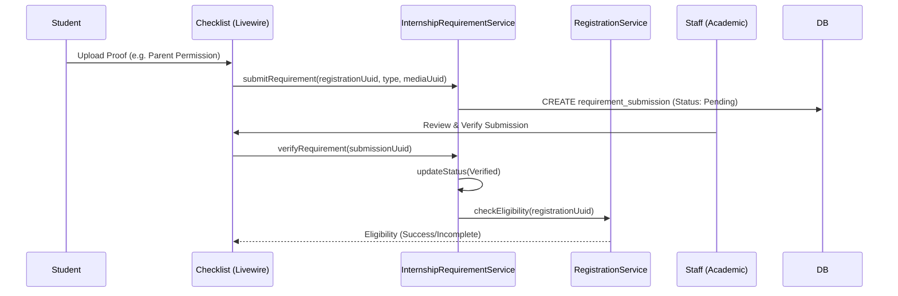

# Application Blueprint: Pre-Placement Checklist (BP-REG-F301)

**Blueprint ID**: `BP-REG-F301` | **Requirement ID**: `SYRS-F-301` | **Scope**: `Internship Lifecycle`

---

## 1. Strategic Context

- **Spec Alignment**: This blueprint authorizes the mandatory requirement verification loop required to satisfy **[SYRS-F-301]** (Pre-Placement Checklist).
- **Objective**: Establish a systematic eligibility gate that ensures students have fulfilled all institutional prerequisites before being eligible for industrial placement.
- **Rationale**: Placement involves legal and administrative obligations. By enforcing a digital checklist, we ensure that the institution's obligations are met for 100% of participating students, reducing liability and administrative friction.

---

## 2. Logic & Architecture (Systemic View)

### 2.1 The Requirement State Machine

Students MUST progress through a two-key verification loop:
1.  **Submission**: Student uploads digitized proof for each mandatory requirement.
2.  **Verification**: Staff audits the proof and marks it as `verified` or `rejected`.

### 2.2 System Interaction Diagram (Eligibility Flow)

### 2.3 Persistence Specification (Schema)

| Column | Type | Index | Nullable | Description |
| :--- | :--- | :--- | :--- | :--- |
| `id` | `UUID` | Primary | No | Submission unique identifier. |
| `registration_id` | `UUID` | Indexed | No | Student registration link. |
| `type` | `String` | No | No | (parent_permission, medical_check, etc.) |
| `media_id` | `UUID` | No | Yes | Link to the forensic media proof. |
| `status` | `Enum` | No | No | (pending, verified, rejected) |
| `verified_by` | `UUID` | No | Yes | The staff member who verified. |

---

## 3. Presentation Strategy (User Experience View)

### 3.1 UX Workflow

- **Dynamic Checklist**: The UI renders a real-time list of "Mandatory" vs. "Optional" requirements.
- **Micro-Verification**: Staff view an "Inbox" allowing for rapid audit/clearance of submissions.

### 3.2 Interface Design

- **Checklist Pulse**: A visual status widget (`internship::requirement-checklist`) indicating cleared items.

---

## 4. Verification Strategy (V&V View)

### 4.1 Unit Verification

- **Eligibility Logic**: Unit tests for `hasClearedMandatory()` covering varied requirement sets.
- **State Audit**: Verification that `Registration` rejects `activate()` if requirements are outstanding.

### 4.2 Feature Validation

- **Authorization Audit**: Ensuring students cannot self-verify.
- **Event Consistency**: Verification that final clearance dispatches `RequirementsCleared`.

### 4.3 Architecture Verification

- **Modular Isolation**: Pest Arch tests ensuring isolation from the `Registration` model.

---

## 5. Compliance & Standardization (Integrity View)

### 5.1 Forensic Integrity

- **Attachment Invariant**: Every verified submission MUST reference a valid `media_id`.

---

## 6. Documentation Strategy (Knowledge View)

### 6.1 Engineering Record

- **Developer Guide**: Update `modules/Internship/README.md` to document the requirement state machine.

### 6.2 Stakeholder Manuals

- **Staff Guide**: Update `docs/wiki/enrollment-matching.md` to document the verification process.

---

## 7. Actionable Implementation Path

1.  **Issue #Req1**: Create `requirement_submissions` migration and model.
2.  **Issue #Req2**: Implement `InternshipRequirementService` with eligibility logic.
3.  **Issue #Req3**: Develop the `Checklist` Volt component for students.
4.  **Issue #Req4**: Build the Staff "Verification Inbox" component.

---

## 8. Exit Criteria & Quality Gates

- **Acceptance Criteria**: Eligibility gate active; Verification loop functional; Event dispatch confirmed.
- **Verification Protocols**: 100% pass rate in the registration test suite.
- **Quality Gate**: Audit confirms zero "Active" students with missing mandatory artifacts.

---

_Application Blueprints prevent architectural decay and ensure continuous alignment with the foundational specifications._
