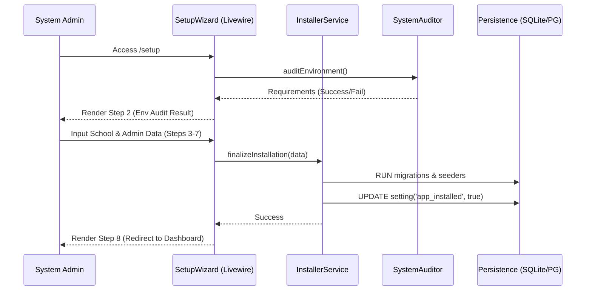

# Application Blueprint: Installation Wizard (BP-SYS-F101)

**Blueprint ID**: `BP-SYS-F101` | **Requirement ID**: `SYRS-F-101` | **Scope**: `System Core`

---

## 1. Strategic Context

- **Spec Alignment**: This blueprint authorizes the construction of the sequential 8-step wizard required to satisfy **[SYRS-F-101]** (Installation Wizard).
- **Objective**: Establish a secure and deterministic bootstrapping mechanism that ensures the system environment is fully audited before any domain operations are permitted.
- **Rationale**: A Modular Monolith requires a coordinated "Cold Start" to initialize shared state, settings, and foundational identities. By formalizing this process, we prevent inconsistent application states and provide a high-fidelity onboarding experience.

---

## 2. Logic & Architecture (Systemic View)

### 2.1 The Setup Process Manager (`Setup` Module)

- **`Modules\Setup\Services\Contracts\InstallerService`**: Centralized orchestrator responsible for executing the installation sequence, including database migrations, system seeding, and application key management.
- **`Modules\Setup\Support\SystemAuditor`**: A stateless utility tier that performs pre-flight environment checks (PHP version, mandatory extensions, directory permissions).

### 2.2 System Interaction Diagram (Process Flow)

### 2.3 Orchestration Sequence (The 8-Step Gate)

The wizard follows a strict state machine to prevent partial installations:
1.  **Welcome**: Initialization of the setup session.
2.  **Environment**: Audit of system prerequisites.
3.  **School**: Establishment of the authoritative institutional identity.
4.  **Account**: Creation of the initial Super-Admin credential.
5.  **Department**: Initialization of the primary academic department.
6.  **Internship**: Setup of the first internship program parameters.
7.  **System**: Final configuration of mail and system-level settings.
8.  **Complete**: Locking of the setup routes and redirection to dashboard.

---

## 3. Presentation Strategy (User Experience View)

### 3.1 UX Workflow

- **Linear Progression**: Users are restricted to a sequential flow using Signed URLs to prevent URL probing or step-skipping.
- **Visual Feedback**: Real-time feedback on environmental audit failures with specific remediation instructions.

### 3.2 Interface Design

- **Setup Layout**: A specialized, minimalist layout (`setup::layouts.setup`) that isolates the installer from the main administrative shell.
- **Progressive Disclosure**: Only the current step's form is visible, reducing cognitive load.

---

## 4. Verification Strategy (V&V View)

### 4.1 Unit Verification

- **Audit Accuracy**: 100% test coverage for `SystemAuditor` logic branches (success/failure scenarios for each prerequisite).
- **Idempotency**: Verification that `InstallerService::install()` can be safely re-run without corrupting existing records.

### 4.2 Feature Validation

- **Sequence Enforcement**: Tests verifying that direct access to Step 5 without completing Steps 1-4 results in a `403 Forbidden`.
- **Brute Force Defense**: Verification of Cloudflare Turnstile and Honeypot token requirements on every form submission.

### 4.3 Architecture Verification

- **Module Isolation**: Pest Arch tests ensuring the `Setup` module maintains zero physical dependencies on domain-specific modules.

---

## 5. Compliance & Standardization (Integrity View)

### 5.1 i18n & Localization

- **Localized Messages**: Zero hard-coded user-facing strings; all feedback MUST be resolved via `setup::messages`.

### 5.2 Security-by-Design

- **Perimeter Locking**: Implementation of the `SYRS-F-102` setup-locking invariant immediately upon completion.

---

## 6. Documentation Strategy (Knowledge View)

### 6.1 Engineering Record

- **Technical Reference**: Update `modules/Setup/README.md` to document the internal service contracts and auditor logic.

### 6.2 Stakeholder Manuals

- **Installation Guide**: Comprehensive walkthrough of the wizard in `docs/wiki/installation.md`.

---

## 7. Actionable Implementation Path

1.  **Issue #Setup1**: Implement `SystemAuditor` with PHP and extension checks.
2.  **Issue #Setup2**: Construct `InstallerService` for atomic cross-module migrations.
3.  **Issue #Setup3**: Develop the multi-step Volt components for the wizard.
4.  **Issue #Setup4**: Implement Signed URL state tracking between steps.

---

## 8. Exit Criteria & Quality Gates

- **Acceptance Criteria**: 8-step wizard functional; environment audit passed; Super-Admin created; Setup routes locked.
- **Verification Protocols**: 100% pass rate in the `Setup` module test suite.
- **Quality Gate**: Zero high-severity violations in the `InstallerService` logic during static analysis.

---

_Application Blueprints prevent architectural decay and ensure continuous alignment with the foundational specifications._
