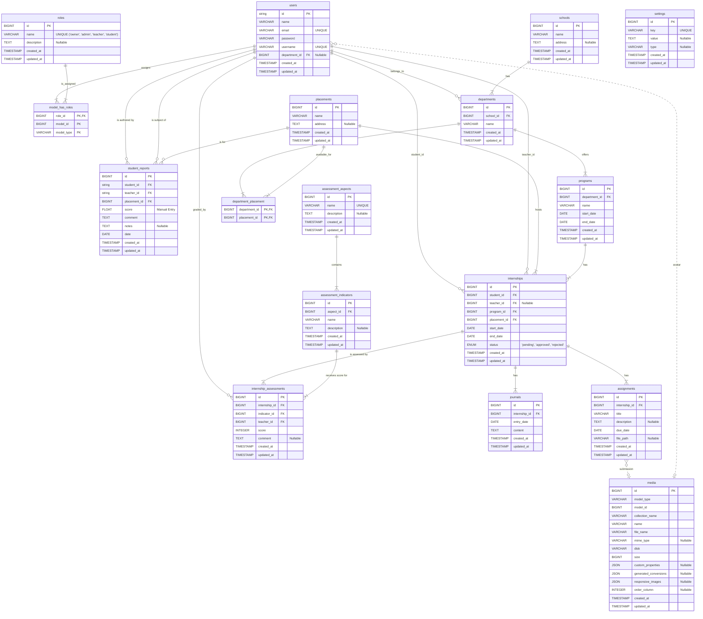

# Internara - Entity-Relationship Diagram (ERD)

This document provides the Entity-Relationship Diagram (ERD) for the Internara MVP, outlining the database schema with a focus on simplicity and core internship lifecycle entities.

---

**Table of Contents**

-   [Internara - Entity-Relationship Diagram (ERD)](#internara---entity-relationship-diagram-erd)
    -   [1. Overview](#1-overview)
    -   [2. ERD Diagram (Mermaid)](#2-erd-diagram-mermaid)
    -   [3. Schema Details](#3-schema-details)
        -   [Core Entities](#core-entities)
        -   [`users`](#users)
        -   [`schools`](#schools)
        -   [`departments`](#departments)
        -   [`programs`](#programs)
        -   [`placements`](#placements)
        -   [Internship \& Assessment Entities](#internship--assessment-entities)
        -   [`internships`](#internships)
        -   [`assessment_aspects`](#assessment_aspects)
        -   [`assessment_indicators`](#assessment_indicators)
        -   [`internship_assessments`](#internship_assessments)
        -   [`reports`](#reports)
        -   [Auxiliary Entities](#auxiliary-entities)
        -   [`roles`](#roles)
        -   [`model_has_roles`](#model_has_roles)
        -   [`department_placement`](#department_placement)
        -   [`journals`](#journals)
        -   [`assignments`](#assignments)
        -   [`settings`](#settings)
        -   [`media`](#media)
    -   [4. Relationships Summary](#4-relationships-summary)

---

## 1. Overview

This document presents the database schema for the Internara Minimum Viable Product (MVP). The design prioritizes simplicity and minimal complexity, aligning with the project's goal of rapid development. The schema is derived directly from the functional requirements, focusing on entities essential for the core internship lifecycle.

## 2. ERD Diagram (Mermaid)

The following Mermaid diagram visually represents the relationships between the database entities. To view this diagram correctly, use an Markdown viewer that supports Mermaid (e.g., GitHub, VS Code with appropriate extensions).

## 3. Schema Details

This section provides detailed descriptions for each database table, including column definitions, types, constraints, and notes.

### Core Entities

These tables represent the foundational master data of the application.

### `users`

Stores information about all users in the system (students, teachers, admins).

| Column          | Type           | Constraints & Notes                                                                 |
| --------------- | -------------- | ----------------------------------------------------------------------------------- |
| `id`            | `string`       | **Primary Key**, UUID                                                               |
| `name`          | `VARCHAR(255)` | User's full name                                                                    |
| `email`         | `VARCHAR(255)` | **Unique**, User's email address                                                    |
| `username`      | `VARCHAR(255)` | **Unique**, User's username (can be used for login)                                 |
| `password`      | `VARCHAR(255)` | Hashed password                                                                     |
| `department_id` | `BIGINT`       | **Foreign Key** to `departments.id`, Nullable (e.g., for non-student/teacher users) |
| `created_at`    | `TIMESTAMP`    | Timestamp of creation                                                               |
| `updated_at`    | `TIMESTAMP`    | Timestamp of last update                                                            |

### `schools`

Stores information about educational institutions.

| Column       | Type           | Constraints & Notes                      |
| ------------ | -------------- | ---------------------------------------- |
| `id`         | `BIGINT`       | **Primary Key**, Auto-incrementing       |
| `name`       | `VARCHAR(255)` | Name of the school                       |
| `address`    | `TEXT`         | Nullable, Physical address of the school |
| `created_at` | `TIMESTAMP`    | Timestamp of creation                    |
| `updated_at` | `TIMESTAMP`    | Timestamp of last update                 |

### `departments`

Stores information about departments within schools.

| Column       | Type           | Constraints & Notes                                   |
| ------------ | -------------- | ----------------------------------------------------- |
| `id`         | `BIGINT`       | **Primary Key**, Auto-incrementing                    |
| `school_id`  | `BIGINT`       | **Foreign Key** to `schools.id` (`ON DELETE CASCADE`) |
| `name`       | `VARCHAR(255)` | Name of the department                                |
| `created_at` | `TIMESTAMP`    | Timestamp of creation                                 |
| `updated_at` | `TIMESTAMP`    | Timestamp of last update                              |

### `programs`

Defines internship programs offered by departments.

| Column          | Type           | Constraints & Notes                                       |
| --------------- | -------------- | --------------------------------------------------------- |
| `id`            | `BIGINT`       | **Primary Key**, Auto-incrementing                        |
| `department_id` | `BIGINT`       | **Foreign Key** to `departments.id` (`ON DELETE CASCADE`) |
| `name`          | `VARCHAR(255)` | e.g., "Internship Batch 1 2025"                           |
| `start_date`    | `DATE`         | Start date of the program                                 |
| `end_date`      | `DATE`         | End date of the program                                   |
| `created_at`    | `TIMESTAMP`    | Timestamp of creation                                     |
| `updated_at`    | `TIMESTAMP`    | Timestamp of last update                                  |

### `placements`

Stores information about organizations/companies offering internship placements.

| Column       | Type           | Constraints & Notes                                  |
| ------------ | -------------- | ---------------------------------------------------- |
| `id`         | `BIGINT`       | **Primary Key**, Auto-incrementing                   |
| `name`       | `VARCHAR(255)` | Name of the company/organization                     |
| `address`    | `TEXT`         | Nullable, Physical address of the placement location |
| `created_at` | `TIMESTAMP`    | Timestamp of creation                                |
| `updated_at` | `TIMESTAMP`    | Timestamp of last update                             |

### Internship & Assessment Entities

These tables manage the internship lifecycle, including registration, assessment, and reporting.

### `internships`

The central entity for each registered internship.

| Column         | Type        | Constraints & Notes                                                                                |
| -------------- | ----------- | -------------------------------------------------------------------------------------------------- |
| `id`           | `BIGINT`    | **Primary Key**, Auto-incrementing                                                                 |
| `student_id`   | `BIGINT`    | **Foreign Key** to `users.id` (`ON DELETE CASCADE`), references the student user                   |
| `teacher_id`   | `BIGINT`    | **Foreign Key** to `users.id` (`ON DELETE SET NULL`), references the supervising teacher, Nullable |
| `program_id`   | `BIGINT`    | **Foreign Key** to `programs.id` (`ON DELETE CASCADE`), the program the internship belongs to      |
| `placement_id` | `BIGINT`    | **Foreign Key** to `placements.id` (`ON DELETE CASCADE`), the organization hosting the internship  |
| `start_date`   | `DATE`      | Official start date of the internship                                                              |
| `end_date`     | `DATE`      | Official end date of the internship                                                                |
| `status`       | `ENUM`      | **'pending', 'approved', 'rejected'**, Current status of the internship                            |
| `created_at`   | `TIMESTAMP` | Timestamp of creation                                                                              |
| `updated_at`   | `TIMESTAMP` | Timestamp of last update                                                                           |

### `assessment_aspects`

Defines high-level areas for student assessment.

| Column        | Type           | Constraints & Notes                                                 |
| ------------- | -------------- | ------------------------------------------------------------------- |
| `id`          | `BIGINT`       | **Primary Key**, Auto-incrementing                                  |
| `name`        | `VARCHAR(255)` | **Unique**, Name of the assessment aspect (e.g., "Professionalism") |
| `description` | `TEXT`         | Nullable, A brief description of the aspect                         |
| `created_at`  | `TIMESTAMP`    | Timestamp of creation                                               |
| `updated_at`  | `TIMESTAMP`    | Timestamp of last update                                            |

### `assessment_indicators`

Defines specific, scorable indicators within an assessment aspect.

| Column        | Type           | Constraints & Notes                                              |
| ------------- | -------------- | ---------------------------------------------------------------- |
| `id`          | `BIGINT`       | **Primary Key**, Auto-incrementing                               |
| `aspect_id`   | `BIGINT`       | **Foreign Key** to `assessment_aspects.id` (`ON DELETE CASCADE`) |
| `name`        | `VARCHAR(255)` | Name of the indicator (e.g., "Punctuality")                      |
| `description` | `TEXT`         | Nullable, A brief description of the indicator                   |
| `created_at`  | `TIMESTAMP`    | Timestamp of creation                                            |
| `updated_at`  | `TIMESTAMP`    | Timestamp of last update                                         |

### `internship_assessments`

Stores individual scores given by a teacher for a specific indicator for a particular internship.

| Column          | Type        | Constraints & Notes                                                                 |
| --------------- | ----------- | ----------------------------------------------------------------------------------- |
| `id`            | `BIGINT`    | **Primary Key**, Auto-incrementing                                                  |
| `internship_id` | `BIGINT`    | **Foreign Key** to `internships.id` (`ON DELETE CASCADE`)                           |
| `indicator_id`  | `BIGINT`    | **Foreign Key** to `assessment_indicators.id` (`ON DELETE CASCADE`)                 |
| `teacher_id`    | `BIGINT`    | **Foreign Key** to `users.id` (`ON DELETE CASCADE`), the teacher who gave the score |
| `score`         | `INTEGER`   | The score given for this indicator (e.g., 1-5)                                      |
| `comment`       | `TEXT`      | Nullable, A specific comment related to this score                                  |
| `created_at`    | `TIMESTAMP` | Timestamp of creation                                                               |
| `updated_at`    | `TIMESTAMP` | Timestamp of last update                                                            |

### `student_reports`

Stores the final, manually-entered report for a student's internship placement.

| Column          | Type           | Constraints & Notes                                     |
| --------------- | -------------- | ------------------------------------------------------- |
| `id`            | `BIGINT`       | **Primary Key**, Auto-incrementing                      |
| `student_id`    | `string`       | **Foreign Key** to `users.id`, the student being reported on |
| `teacher_id`    | `string`       | **Foreign Key** to `users.id`, the teacher authoring the report |
| `placement_id`  | `BIGINT`       | **Foreign Key** to `placements.id`                        |
| `score`         | `FLOAT`        | Manually entered final score                            |
| `comment`       | `TEXT`         | Manually entered summary comment                        |
| `notes`         | `TEXT`         | Nullable, Additional private notes for the report       |
| `date`          | `DATE`         | The date the report is for                              |
| `created_at`    | `TIMESTAMP`    | Timestamp of creation                                   |
| `updated_at`    | `TIMESTAMP`    | Timestamp of last update                                |

### Auxiliary Entities

These tables support various functionalities like user roles, many-to-many relationships, and general content management.

### `roles`

Defines user roles in the application (e.g., 'owner', 'admin', 'teacher', 'student'), where 'owner' is the primary administrative role.

| Column        | Type           | Constraints & Notes                       |
| ------------- | -------------- | ----------------------------------------- |
| `id`          | `BIGINT`       | **Primary Key**, Auto-incrementing        |
| `name`        | `VARCHAR(255)` | **Unique**, The name of the role          |
| `description` | `TEXT`         | Nullable, A brief description of the role |
| `created_at`  | `TIMESTAMP`    | Timestamp of creation                     |
| `updated_at`  | `TIMESTAMP`    | Timestamp of last update                  |

### `model_has_roles`

Pivot table for assigning roles to various models (e.g., `users`).

| Column       | Type           | Constraints & Notes                                                                    |
| ------------ | -------------- | -------------------------------------------------------------------------------------- |
| `role_id`    | `BIGINT`       | **Primary Key**, **Foreign Key** to `roles.id` (`ON DELETE CASCADE`)                   |
| `model_type` | `VARCHAR(255)` | **Primary Key**, The fully qualified class name of the model (e.g., `App\Models\User`) |
| `model_id`   | `BIGINT`       | **Primary Key**, The ID of the model instance                                          |

### `department_placement`

Pivot table for the many-to-many relationship between `departments` and `placements`.

| Column          | Type     | Constraints & Notes                                                        |
| --------------- | -------- | -------------------------------------------------------------------------- |
| `department_id` | `BIGINT` | **Primary Key**, **Foreign Key** to `departments.id` (`ON DELETE CASCADE`) |
| `placement_id`  | `BIGINT` | **Primary Key**, **Foreign Key** to `placements.id` (`ON DELETE CASCADE`)  |

### `journals`

Stores daily log entries submitted by students during their internships.

| Column          | Type        | Constraints & Notes                                       |
| --------------- | ----------- | --------------------------------------------------------- |
| `id`            | `BIGINT`    | **Primary Key**, Auto-incrementing                        |
| `internship_id` | `BIGINT`    | **Foreign Key** to `internships.id` (`ON DELETE CASCADE`) |
| `entry_date`    | `DATE`      | The date of the journal entry                             |
| `content`       | `TEXT`      | The content of the journal entry                          |
| `created_at`    | `TIMESTAMP` | Timestamp of creation                                     |
| `updated_at`    | `TIMESTAMP` | Timestamp of last update                                  |

### `assignments`

Stores details of assignments given to students.

| Column          | Type           | Constraints & Notes                                         |
| --------------- | -------------- | ----------------------------------------------------------- |
| `id`            | `BIGINT`       | **Primary Key**, Auto-incrementing                          |
| `internship_id` | `BIGINT`       | **Foreign Key** to `internships.id` (`ON DELETE CASCADE`)   |
| `title`         | `VARCHAR(255)` | Title of the assignment                                     |
| `description`   | `TEXT`         | Nullable, Description of the assignment                     |
| `due_date`      | `DATE`         | Due date for the assignment                                 |
| `file_path`     | `VARCHAR(255)` | Nullable, Path to the assignment file (e.g., for templates) |
| `created_at`    | `TIMESTAMP`    | Timestamp of creation                                       |
| `updated_at`    | `TIMESTAMP`    | Timestamp of last update                                    |

### `settings`

Stores application-wide settings as key-value pairs.

| Column       | Type           | Constraints & Notes                                                           |
| ------------ | -------------- | ----------------------------------------------------------------------------- |
| `id`         | `BIGINT`       | **Primary Key**, Auto-incrementing                                            |
| `key`        | `VARCHAR(255)` | **Unique**, The setting key (e.g., `app_name`, `email_notifications_enabled`) |
| `value`      | `TEXT`         | Nullable, The setting value (can store serialized data)                       |
| `type`       | `VARCHAR(255)` | Nullable, Data type hint for the value (e.g., `string`, `boolean`, `json`)    |
| `created_at` | `TIMESTAMP`    | Timestamp of creation                                                         |
| `updated_at` | `TIMESTAMP`    | Timestamp of last update                                                      |

### `media`

Generic table for handling file uploads, often used with a package like Spatie Media Library.

| Column                  | Type           | Constraints & Notes                                      |
| ----------------------- | -------------- | -------------------------------------------------------- |
| `id`                    | `BIGINT`       | **Primary Key**, Auto-incrementing                       |
| `model_type`            | `VARCHAR(255)` | The fully qualified class name of the associated model   |
| `model_id`              | `BIGINT`       | The ID of the associated model instance                  |
| `collection_name`       | `VARCHAR(255)` | Name of the media collection                             |
| `name`                  | `VARCHAR(255)` | Original name of the file                                |
| `file_name`             | `VARCHAR(255)` | Stored file name                                         |
| `mime_type`             | `VARCHAR(255)` | Nullable, MIME type of the file                          |
| `disk`                  | `VARCHAR(255)` | The disk where the file is stored (e.g., `public`, `s3`) |
| `size`                  | `BIGINT`       | Size of the file in bytes                                |
| `custom_properties`     | `JSON`         | Nullable, Custom JSON properties                         |
| `generated_conversions` | `JSON`         | Nullable, JSON for generated image conversions           |
| `responsive_images`     | `JSON`         | Nullable, JSON for responsive image data                 |
| `order_column`          | `INTEGER`      | Nullable, Order in a collection                          |
| `created_at`            | `TIMESTAMP`    | Timestamp of creation                                    |
| `updated_at`            | `TIMESTAMP`    | Timestamp of last update                                 |

## 4. Relationships Summary

This section summarizes the key relationships between the entities in the Internara database.

-   **User Management:**
    -   `users` `belongs to` a `department`.
    -   `users` `can have many` `roles` (via `model_has_roles`).
-   **Organizational Structure:**
    -   `schools` `have many` `departments`.
    -   `departments` `offer many` `programs`.
    -   `departments` `can be associated with many` `placements` (many-to-many via `department_placement`).
-   **Internship Lifecycle:**
    -   `programs` `have many` `internships`.
    -   `placements` `host many` `internships`.
    -   `internships` `belong to` a `student` (`users.id`) and `can be supervised by` a `teacher` (`users.id`).
    -   `internships` `have many` `journals` and `assignments`.
-   **Assessment & Reporting:**
    -   `assessment_aspects` `contain many` `assessment_indicators`.
    -   `internships` `are assessed by many` `internship_assessments`, each linked to an `assessment_indicator` and a `teacher`.
    -   `internships` `have one` `report`.
-   **Media Management:**
    -   `reports`, `assignments`, and `users` (e.g., for avatars) `can have many` associated `media` files (polymorphic relationship).
